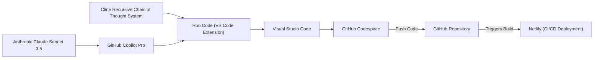

# Shameless vibe-coding CI/CD pipeline
High-level details of the current development pipeline I'm using. Expect this to evolve as tweaks and improvements are made.

The main requirements in my search for an agentic coding setup are sustainability and reliability, I have to say this delivers. 

I'm making awesome progress with my projects, while paying a flat monthly fee for the best coding model available. I can rely on this system to give me the outcome I want without it losing the plot (much).

Thanks to Waylon for sharing your discoveries!

## Who this is for
If you are just wanting something easy to help you prototype an idea then you might be better off with https://v0.dev/ or https://lovable.dev/. 

If you dont mind getting a little technical and are looking for something a bit more robust, then this is the way.

## Component diagram

## Components
### Visual Studio Code
- Our code editor - https://code.visualstudio.com/

### GitHub
- Code repository - https://github.com/

### GitHub Codespace
- Cloud-based IDE - https://code.visualstudio.com/docs/remote/codespaces

### Roo Code
- Autonomous coding agent (visual studio code extension) - https://marketplace.visualstudio.com/items?itemName=RooVeterinaryInc.roo-cline

### Cline Recursive Chain of Thought System
- System prompt for roo, essentially "memory" providing dynamic context for code changes - https://github.com/RPG-fan/Cline-Recursive-Chain-of-Thought-System-CRCT-

### Github Copilot Pro
- Monthly subscription providing access to a range of language models - https://github.com/features/copilot/plans?cft=copilot_li.features_copilot

### Anthropic Claude Sonnet 3.5
- Coding model of choice. Running through Github Copilot Pro - https://claude.ai/

### Netlify
- CI/CD deployment target. Hosts our website, provides continuous deployment on code commit - https://www.netlify.com/
