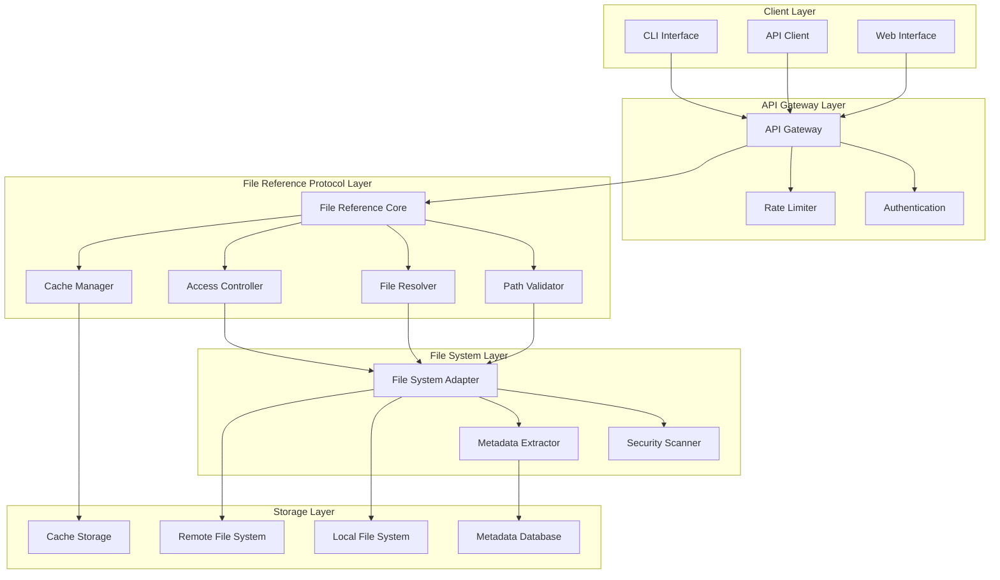
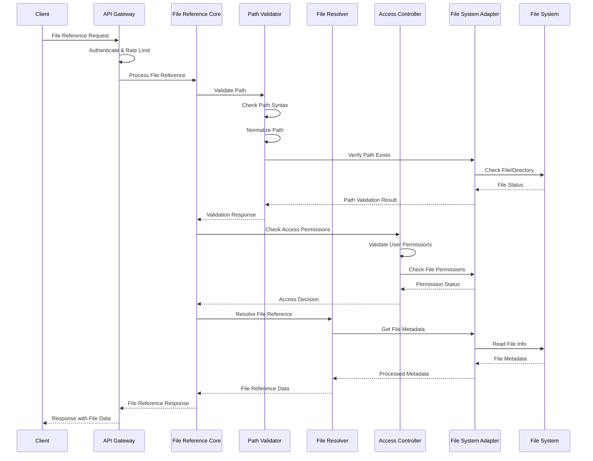
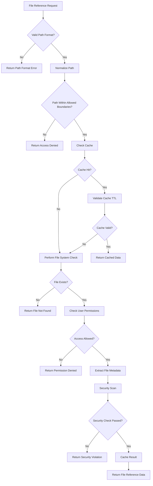
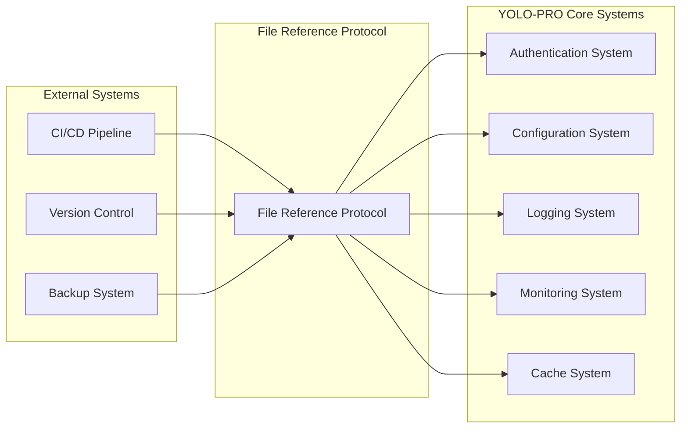
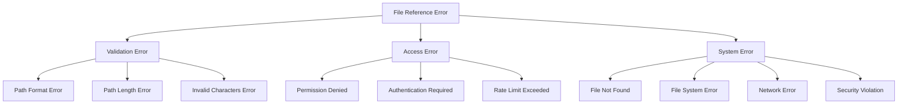
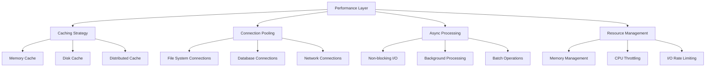
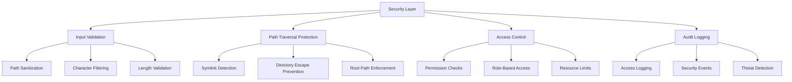
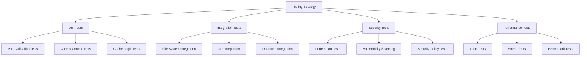
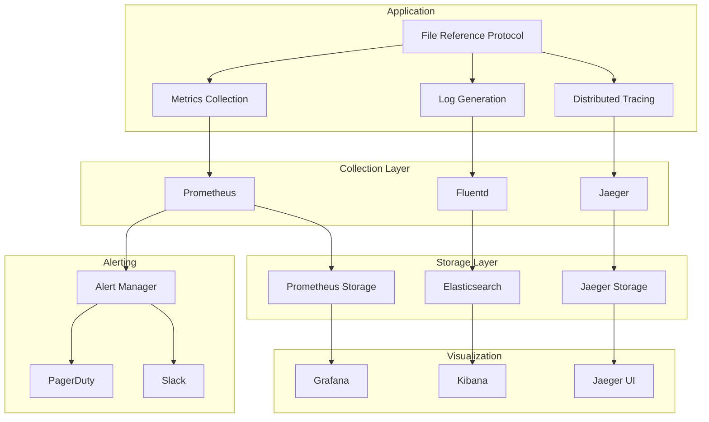

# Feature 6: File Reference Protocol Architecture

## Overview

The File Reference Protocol Implementation provides a secure, high-performance system for managing file paths, validating access, and processing file references across the YOLO-PRO ecosystem. This architecture ensures safe file operations while maintaining optimal performance and security.

## 1. Component Interaction Diagrams

### 1.1 High-Level System Architecture



### 1.2 Component Interaction Flow



## 2. Data Flow for File Reference Operations

### 2.1 File Reference Request Flow



### 2.2 Data Structures

```typescript
interface FileReference {
  id: string;
  path: string;
  normalizedPath: string;
  type: 'file' | 'directory' | 'symlink';
  metadata: FileMetadata;
  permissions: FilePermissions;
  securityStatus: SecurityStatus;
  cacheInfo: CacheInfo;
  timestamp: Date;
}

interface FileMetadata {
  size: number;
  lastModified: Date;
  mimeType: string;
  encoding: string;
  checksum: string;
  attributes: Record<string, any>;
}

interface FilePermissions {
  read: boolean;
  write: boolean;
  execute: boolean;
  owner: string;
  group: string;
  mode: string;
}

interface SecurityStatus {
  scanned: boolean;
  safe: boolean;
  threats: SecurityThreat[];
  scanTimestamp: Date;
}

interface CacheInfo {
  cached: boolean;
  cacheKey: string;
  ttl: number;
  expiresAt: Date;
}
```

## 3. Integration Points with Existing YOLO-PRO Systems

### 3.1 System Integration Architecture



### 3.2 Integration Specifications

#### 3.2.1 Authentication System Integration
```yaml
authentication_integration:
  endpoint: "/api/auth/validate"
  method: "POST"
  headers:
    - "Authorization: Bearer {token}"
    - "X-API-Key: {api_key}"
  
  request_payload:
    user_id: string
    resource_path: string
    action: "read" | "write" | "execute"
  
  response_format:
    authorized: boolean
    permissions: string[]
    session_id: string
    expires_at: timestamp
```

#### 3.2.2 Configuration System Integration
```yaml
configuration_integration:
  config_keys:
    - "file_reference.max_path_length"
    - "file_reference.allowed_extensions"
    - "file_reference.blocked_paths"
    - "file_reference.cache_ttl"
    - "file_reference.security_scan_enabled"
  
  dynamic_config:
    hot_reload: true
    validation: true
    fallback_values: true
```

#### 3.2.3 Logging System Integration
```yaml
logging_integration:
  log_levels:
    - DEBUG: "Path validation details"
    - INFO: "File access granted/denied"
    - WARN: "Security scan warnings"
    - ERROR: "File system errors"
    - CRITICAL: "Security violations"
  
  structured_logs:
    timestamp: ISO8601
    user_id: string
    session_id: string
    operation: string
    path: string
    result: "success" | "failure"
    metadata: object
```

## 4. Error Handling Flow

### 4.1 Error Hierarchy



### 4.2 Error Handling Strategy

```typescript
class FileReferenceErrorHandler {
  async handleError(error: Error, context: ErrorContext): Promise<ErrorResponse> {
    // Log error with context
    await this.logError(error, context);
    
    // Determine error type and severity
    const errorType = this.classifyError(error);
    const severity = this.determineSeverity(error);
    
    // Apply error handling strategy
    switch (errorType) {
      case ErrorType.VALIDATION:
        return this.handleValidationError(error as ValidationError);
      
      case ErrorType.ACCESS:
        return this.handleAccessError(error as AccessError);
      
      case ErrorType.SYSTEM:
        return this.handleSystemError(error as SystemError);
      
      default:
        return this.handleGenericError(error);
    }
  }
  
  private async handleValidationError(error: ValidationError): Promise<ErrorResponse> {
    return {
      code: 'VALIDATION_ERROR',
      message: error.message,
      details: error.validationDetails,
      recoverable: true,
      suggestions: this.generateSuggestions(error)
    };
  }
  
  private async handleAccessError(error: AccessError): Promise<ErrorResponse> {
    // Implement security logging
    await this.securityLogger.logAccessViolation(error);
    
    return {
      code: 'ACCESS_DENIED',
      message: 'Access to the requested resource is denied',
      details: null, // Don't expose internal details for security
      recoverable: false,
      suggestions: ['Check your permissions', 'Contact administrator']
    };
  }
}
```

### 4.3 Error Recovery Mechanisms

```yaml
error_recovery:
  retry_policies:
    network_errors:
      max_attempts: 3
      backoff_strategy: "exponential"
      base_delay: 1000ms
    
    file_system_errors:
      max_attempts: 2
      backoff_strategy: "linear"
      base_delay: 500ms
  
  circuit_breaker:
    failure_threshold: 5
    timeout: 30000ms
    recovery_timeout: 60000ms
  
  fallback_strategies:
    cache_miss: "return_empty_result"
    permission_check_fail: "deny_access"
    metadata_extraction_fail: "basic_metadata_only"
```

## 5. Performance Considerations for File Operations

### 5.1 Performance Architecture



### 5.2 Caching Strategy

```typescript
interface CacheStrategy {
  levels: CacheLevel[];
  policies: CachePolicies;
  invalidation: InvalidationStrategy;
}

interface CacheLevel {
  name: string;
  type: 'memory' | 'disk' | 'distributed';
  ttl: number;
  maxSize: number;
  evictionPolicy: 'LRU' | 'LFU' | 'TTL';
}

const cacheConfig: CacheStrategy = {
  levels: [
    {
      name: 'L1_Memory',
      type: 'memory',
      ttl: 300000, // 5 minutes
      maxSize: 1000,
      evictionPolicy: 'LRU'
    },
    {
      name: 'L2_Disk',
      type: 'disk',
      ttl: 3600000, // 1 hour
      maxSize: 10000,
      evictionPolicy: 'TTL'
    },
    {
      name: 'L3_Distributed',
      type: 'distributed',
      ttl: 86400000, // 24 hours
      maxSize: 100000,
      evictionPolicy: 'LFU'
    }
  ],
  policies: {
    writeThrough: true,
    readAside: true,
    refreshAhead: true
  },
  invalidation: {
    onWrite: true,
    onDelete: true,
    onPermissionChange: true
  }
};
```

### 5.3 Performance Metrics and Monitoring

```yaml
performance_metrics:
  response_time:
    - p50: "<100ms"
    - p95: "<500ms"
    - p99: "<1000ms"
  
  throughput:
    - requests_per_second: ">1000"
    - concurrent_operations: ">100"
  
  resource_utilization:
    - cpu_usage: "<70%"
    - memory_usage: "<80%"
    - disk_io: "<80%"
  
  cache_performance:
    - hit_ratio: ">90%"
    - miss_penalty: "<50ms"
  
  error_rates:
    - total_error_rate: "<1%"
    - timeout_rate: "<0.1%"
    - security_violations: "<0.01%"
```

### 5.4 Optimization Techniques

```typescript
class FileOperationOptimizer {
  // Batch multiple file operations
  async batchFileOperations(operations: FileOperation[]): Promise<BatchResult[]> {
    const grouped = this.groupByFileSystem(operations);
    const promises = Object.entries(grouped).map(([fsType, ops]) =>
      this.executeBatch(fsType, ops)
    );
    
    return Promise.all(promises);
  }
  
  // Implement read-ahead for predictable access patterns
  async readAheadCache(path: string): Promise<void> {
    const predictedPaths = this.predictNextAccess(path);
    const cachePromises = predictedPaths.map(p => this.preloadToCache(p));
    
    // Fire and forget - don't await
    Promise.all(cachePromises).catch(err => this.logger.warn('Read-ahead failed', err));
  }
  
  // Parallel metadata extraction
  async extractMetadataParallel(files: string[]): Promise<FileMetadata[]> {
    const chunks = this.chunkArray(files, 10); // Process 10 files at a time
    const results: FileMetadata[] = [];
    
    for (const chunk of chunks) {
      const chunkResults = await Promise.all(
        chunk.map(file => this.extractSingleMetadata(file))
      );
      results.push(...chunkResults);
    }
    
    return results;
  }
}
```

## 6. Security Considerations for Path Validation

### 6.1 Security Architecture



### 6.2 Path Validation Security

```typescript
class SecurePathValidator {
  private readonly DANGEROUS_PATTERNS = [
    /\.\./g,           // Directory traversal
    /~\//g,            // Home directory access
    /\/\//g,           // Double slashes
    /[<>:"|?*]/g,      // Windows invalid characters
    /\x00/g,           // Null bytes
    /^\//g,            // Absolute paths (when not allowed)
  ];
  
  private readonly BLOCKED_EXTENSIONS = [
    '.exe', '.bat', '.cmd', '.scr', '.pif', '.com',
    '.sh', '.bash', '.zsh', '.ps1', '.vbs', '.js'
  ];
  
  async validatePath(path: string, context: ValidationContext): Promise<ValidationResult> {
    const result = new ValidationResult();
    
    // 1. Basic format validation
    if (!this.isValidFormat(path)) {
      result.addError('Invalid path format');
      return result;
    }
    
    // 2. Check for dangerous patterns
    if (this.containsDangerousPatterns(path)) {
      result.addError('Path contains dangerous patterns');
      await this.logSecurityViolation('dangerous_pattern', path, context);
      return result;
    }
    
    // 3. Normalize and resolve path
    const normalizedPath = await this.normalizePath(path);
    
    // 4. Check if within allowed boundaries
    if (!this.isWithinAllowedBoundaries(normalizedPath, context.allowedRoots)) {
      result.addError('Path outside allowed boundaries');
      await this.logSecurityViolation('boundary_violation', path, context);
      return result;
    }
    
    // 5. Check file extension
    if (this.hasBlockedExtension(normalizedPath)) {
      result.addError('File type not allowed');
      return result;
    }
    
    // 6. Symlink resolution and validation
    const resolvedPath = await this.resolveSymlinks(normalizedPath);
    if (!this.isWithinAllowedBoundaries(resolvedPath, context.allowedRoots)) {
      result.addError('Symlink target outside allowed boundaries');
      await this.logSecurityViolation('symlink_violation', path, context);
      return result;
    }
    
    result.normalizedPath = normalizedPath;
    result.resolvedPath = resolvedPath;
    result.valid = true;
    
    return result;
  }
  
  private isWithinAllowedBoundaries(path: string, allowedRoots: string[]): boolean {
    const resolvedPath = require('path').resolve(path);
    
    return allowedRoots.some(root => {
      const resolvedRoot = require('path').resolve(root);
      return resolvedPath.startsWith(resolvedRoot + require('path').sep) ||
             resolvedPath === resolvedRoot;
    });
  }
}
```

### 6.3 Access Control Implementation

```typescript
interface AccessControlPolicy {
  rules: AccessRule[];
  defaultAction: 'allow' | 'deny';
  enforcementMode: 'strict' | 'permissive';
}

interface AccessRule {
  id: string;
  priority: number;
  conditions: RuleCondition[];
  action: 'allow' | 'deny';
  resources: ResourceMatcher[];
  subjects: SubjectMatcher[];
}

class FileAccessController {
  async checkAccess(
    subject: SecuritySubject,
    resource: FileResource,
    operation: FileOperation
  ): Promise<AccessDecision> {
    
    const decision = new AccessDecision();
    
    // 1. Apply access control policies
    const applicableRules = await this.findApplicableRules(subject, resource, operation);
    const sortedRules = this.sortRulesByPriority(applicableRules);
    
    // 2. Evaluate rules in priority order
    for (const rule of sortedRules) {
      const evaluation = await this.evaluateRule(rule, subject, resource, operation);
      
      if (evaluation.matches) {
        decision.decision = rule.action;
        decision.matchingRule = rule;
        decision.reason = evaluation.reason;
        break;
      }
    }
    
    // 3. Apply default policy if no rules matched
    if (!decision.decision) {
      decision.decision = this.policy.defaultAction;
      decision.reason = 'Default policy applied';
    }
    
    // 4. Log access decision
    await this.logAccessDecision(decision, subject, resource, operation);
    
    return decision;
  }
  
  private async evaluateRule(
    rule: AccessRule,
    subject: SecuritySubject,
    resource: FileResource,
    operation: FileOperation
  ): Promise<RuleEvaluation> {
    
    // Check all conditions must match
    for (const condition of rule.conditions) {
      const match = await this.evaluateCondition(condition, subject, resource, operation);
      if (!match.satisfied) {
        return { matches: false, reason: match.reason };
      }
    }
    
    return { matches: true, reason: 'All conditions satisfied' };
  }
}
```

### 6.4 Security Monitoring and Alerting

```yaml
security_monitoring:
  real_time_alerts:
    - pattern: "Multiple failed access attempts"
      threshold: 5
      time_window: "5 minutes"
      action: "block_user_temporarily"
    
    - pattern: "Path traversal attempt"
      threshold: 1
      time_window: "immediate"
      action: "alert_security_team"
    
    - pattern: "Access to blocked extensions"
      threshold: 3
      time_window: "10 minutes"
      action: "escalate_to_admin"
  
  audit_requirements:
    - retention_period: "7 years"
    - encryption: "AES-256"
    - integrity_checking: true
    - access_logging: true
    - change_tracking: true
  
  compliance_checks:
    - standard: "SOC2"
      controls: ["CC6.1", "CC6.2", "CC6.3"]
    - standard: "PCI-DSS"
      controls: ["10.2", "10.3"]
    - standard: "GDPR"
      controls: ["Article 32", "Article 25"]
```

## 7. Deployment Architecture

### 7.1 Container Architecture

```dockerfile
# Multi-stage build for File Reference Protocol
FROM node:18-alpine AS builder
WORKDIR /app
COPY package*.json ./
RUN npm ci --only=production

FROM node:18-alpine AS runtime
WORKDIR /app

# Security: Create non-root user
RUN addgroup -g 1001 -S app && \
    adduser -S app -u 1001

# Copy application files
COPY --from=builder /app/node_modules ./node_modules
COPY --chown=app:app . .

# Security: Set file permissions
RUN chmod -R 755 /app && \
    chmod -R 644 /app/config

# Health check
HEALTHCHECK --interval=30s --timeout=10s --start-period=5s --retries=3 \
  CMD node healthcheck.js

USER app
EXPOSE 3000
CMD ["node", "server.js"]
```

### 7.2 Kubernetes Deployment

```yaml
apiVersion: apps/v1
kind: Deployment
metadata:
  name: file-reference-protocol
  labels:
    app: file-reference-protocol
    version: v1.0.0
spec:
  replicas: 3
  selector:
    matchLabels:
      app: file-reference-protocol
  template:
    metadata:
      labels:
        app: file-reference-protocol
        version: v1.0.0
    spec:
      securityContext:
        runAsNonRoot: true
        runAsUser: 1001
        fsGroup: 1001
      
      containers:
      - name: file-reference-protocol
        image: file-reference-protocol:v1.0.0
        imagePullPolicy: Always
        
        ports:
        - containerPort: 3000
          name: http
        
        env:
        - name: NODE_ENV
          value: "production"
        - name: LOG_LEVEL
          value: "info"
        
        resources:
          requests:
            memory: "256Mi"
            cpu: "250m"
          limits:
            memory: "512Mi"
            cpu: "500m"
        
        livenessProbe:
          httpGet:
            path: /health/live
            port: 3000
          initialDelaySeconds: 30
          periodSeconds: 10
          timeoutSeconds: 5
          failureThreshold: 3
        
        readinessProbe:
          httpGet:
            path: /health/ready
            port: 3000
          initialDelaySeconds: 5
          periodSeconds: 5
          timeoutSeconds: 3
          failureThreshold: 3
        
        securityContext:
          allowPrivilegeEscalation: false
          readOnlyRootFilesystem: true
          capabilities:
            drop:
            - ALL
        
        volumeMounts:
        - name: tmp-volume
          mountPath: /tmp
        - name: cache-volume
          mountPath: /app/cache
      
      volumes:
      - name: tmp-volume
        emptyDir: {}
      - name: cache-volume
        emptyDir: {}
      
      affinity:
        podAntiAffinity:
          preferredDuringSchedulingIgnoredDuringExecution:
          - weight: 100
            podAffinityTerm:
              labelSelector:
                matchExpressions:
                - key: app
                  operator: In
                  values:
                  - file-reference-protocol
              topologyKey: kubernetes.io/hostname
```

## 8. Testing Strategy

### 8.1 Test Architecture



### 8.2 Test Coverage Requirements

```yaml
test_coverage:
  minimum_coverage: 90%
  critical_paths: 100%
  
  test_types:
    unit_tests:
      coverage: 95%
      focus: "Business logic, validation, security"
    
    integration_tests:
      coverage: 80%
      focus: "API endpoints, database operations"
    
    security_tests:
      coverage: 100%
      focus: "Path validation, access control, injection attacks"
    
    performance_tests:
      coverage: "All critical paths"
      focus: "Response times, throughput, resource usage"
```

## 9. Monitoring and Observability

### 9.1 Monitoring Architecture



### 9.2 Key Performance Indicators (KPIs)

```yaml
kpis:
  availability:
    target: 99.9%
    measurement: "Service uptime"
    alert_threshold: 99.5%
  
  response_time:
    p50_target: 50ms
    p95_target: 200ms
    p99_target: 500ms
    alert_threshold: 1000ms
  
  throughput:
    target: 1000_rps
    peak_capacity: 5000_rps
    alert_threshold: 80%_capacity
  
  error_rate:
    target: 0.1%
    critical_threshold: 1%
    security_violation_threshold: 0.01%
  
  cache_performance:
    hit_ratio_target: 90%
    miss_penalty_target: 50ms
    alert_threshold: 80%_hit_ratio
```

## 10. Conclusion

This architecture provides a robust, secure, and high-performance foundation for the File Reference Protocol Implementation. Key architectural decisions include:

1. **Security-First Design**: Multiple layers of validation and access control
2. **Performance Optimization**: Multi-level caching and async processing
3. **Scalability**: Horizontal scaling with load balancing
4. **Observability**: Comprehensive monitoring and alerting
5. **Integration**: Seamless integration with existing YOLO-PRO systems

The architecture supports the core requirements while maintaining flexibility for future enhancements and scaling needs.