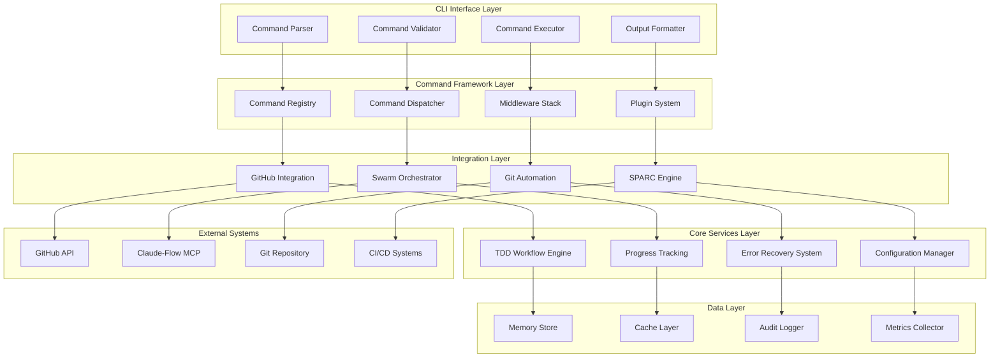
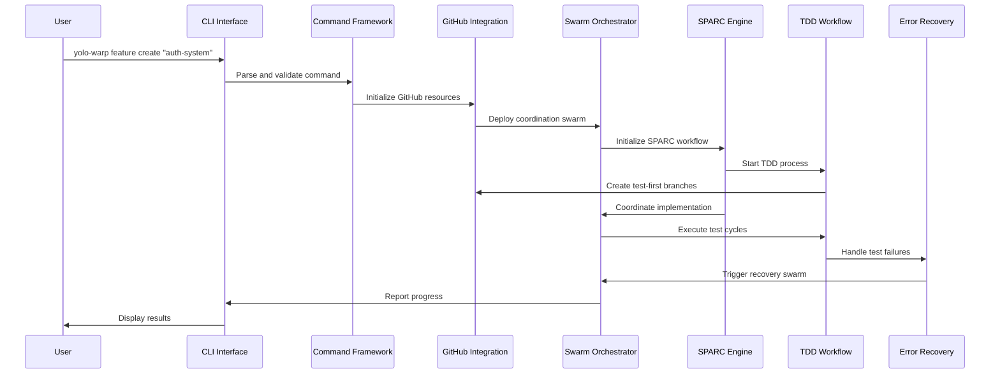

# Feature 8: Comprehensive CLI Commands Architecture

## Overview

The Comprehensive CLI Commands Implementation provides a robust, extensible command-line interface for the yolo-warp system, integrating seamlessly with GitHub, Claude-Flow swarm orchestration, and SPARC methodology execution. This architecture enables automated workflow management, test-driven development, and intelligent error recovery across complex development scenarios.

## 1. System Architecture Overview

### 1.1 High-Level Architecture



### 1.2 Component Interaction Flow



## 2. CLI Command Framework

### 2.1 Command Structure

```typescript
// Core Command Interface
interface CLICommand {
  name: string;
  description: string;
  category: CommandCategory;
  options: CommandOption[];
  subcommands?: CLICommand[];
  middleware: MiddlewareFunction[];
  handler: CommandHandler;
  validation: ValidationRules;
  permissions: PermissionSet;
}

// Command Categories
enum CommandCategory {
  FEATURE = 'feature',
  WORKFLOW = 'workflow',
  GITHUB = 'github',
  SWARM = 'swarm',
  SPARC = 'sparc',
  TDD = 'tdd',
  SYSTEM = 'system'
}

// Command Registry
class CommandRegistry {
  private commands: Map<string, CLICommand> = new Map();
  private aliases: Map<string, string> = new Map();
  
  register(command: CLICommand): void {
    this.commands.set(command.name, command);
    this.validateCommand(command);
    this.registerSubcommands(command);
  }
  
  resolve(commandPath: string[]): CommandResolution {
    const [rootCommand, ...subPath] = commandPath;
    const command = this.commands.get(rootCommand) || 
                   this.commands.get(this.aliases.get(rootCommand));
    
    if (!command) {
      throw new CommandNotFoundError(rootCommand);
    }
    
    return this.resolveSubcommand(command, subPath);
  }
}

// Example: Feature Command Structure
const featureCommand: CLICommand = {
  name: 'feature',
  description: 'Manage feature development lifecycle',
  category: CommandCategory.FEATURE,
  options: [
    {
      name: 'epic',
      description: 'Epic issue number',
      type: 'number',
      required: false
    },
    {
      name: 'swarm-enabled',
      description: 'Enable swarm coordination',
      type: 'boolean',
      default: true
    }
  ],
  subcommands: [
    {
      name: 'create',
      description: 'Create new feature with TDD workflow',
      handler: new FeatureCreateHandler(),
      validation: {
        args: { min: 1, max: 1 },
        options: ['epic', 'swarm-enabled']
      }
    },
    {
      name: 'progress',
      description: 'Show feature development progress',
      handler: new FeatureProgressHandler(),
      validation: {
        args: { min: 0, max: 1 }
      }
    }
  ],
  middleware: [
    authenticationMiddleware,
    githubConnectionMiddleware,
    swarmInitializationMiddleware
  ],
  handler: new FeatureCommandHandler(),
  validation: {
    args: { min: 1 },
    permissions: ['feature:manage']
  },
  permissions: new Set(['github:read', 'github:write', 'swarm:deploy'])
};
```

### 2.2 Command Parser and Validator

```typescript
// Advanced Command Parser
class CommandParser {
  parse(args: string[]): ParsedCommand {
    const lexer = new CommandLexer(args);
    const tokens = lexer.tokenize();
    
    return this.buildCommandTree(tokens);
  }
  
  private buildCommandTree(tokens: Token[]): ParsedCommand {
    const commandTokens = tokens.filter(t => t.type === TokenType.COMMAND);
    const optionTokens = tokens.filter(t => t.type === TokenType.OPTION);
    const argumentTokens = tokens.filter(t => t.type === TokenType.ARGUMENT);
    
    return {
      command: commandTokens.map(t => t.value),
      options: this.parseOptions(optionTokens),
      arguments: argumentTokens.map(t => t.value),
      flags: this.parseFlags(optionTokens)
    };
  }
}

// Command Validator
class CommandValidator {
  async validate(
    parsed: ParsedCommand, 
    command: CLICommand
  ): Promise<ValidationResult> {
    const result = new ValidationResult();
    
    // Validate argument count
    await this.validateArguments(parsed.arguments, command.validation, result);
    
    // Validate options
    await this.validateOptions(parsed.options, command.options, result);
    
    // Validate permissions
    await this.validatePermissions(command.permissions, result);
    
    // Custom validation rules
    if (command.validation.custom) {
      await command.validation.custom(parsed, result);
    }
    
    return result;
  }
  
  private async validateArguments(
    args: string[],
    validation: ValidationRules,
    result: ValidationResult
  ): Promise<void> {
    if (validation.args) {
      if (args.length < validation.args.min) {
        result.addError(`Insufficient arguments. Expected at least ${validation.args.min}`);
      }
      if (args.length > validation.args.max) {
        result.addError(`Too many arguments. Expected at most ${validation.args.max}`);
      }
    }
  }
}
```

### 2.3 Middleware System

```typescript
// Middleware Interface
interface MiddlewareFunction {
  (context: CommandContext, next: NextFunction): Promise<void>;
}

// Authentication Middleware
const authenticationMiddleware: MiddlewareFunction = async (context, next) => {
  const authToken = await context.config.getSecure('github_token');
  
  if (!authToken || await this.isTokenExpired(authToken)) {
    throw new AuthenticationError('GitHub authentication required');
  }
  
  context.auth = { token: authToken };
  await next();
};

// GitHub Connection Middleware
const githubConnectionMiddleware: MiddlewareFunction = async (context, next) => {
  const github = new GitHubClient(context.auth.token);
  
  try {
    await github.validateConnection();
    context.github = github;
  } catch (error) {
    throw new ConnectionError('Failed to connect to GitHub API', error);
  }
  
  await next();
};

// Swarm Initialization Middleware
const swarmInitializationMiddleware: MiddlewareFunction = async (context, next) => {
  if (context.options['swarm-enabled']) {
    const swarm = await context.claudeFlow.swarm.initialize({
      topology: 'hierarchical',
      maxAgents: 6
    });
    
    context.swarm = swarm;
  }
  
  await next();
};

// Middleware Stack
class MiddlewareStack {
  private middleware: MiddlewareFunction[] = [];
  
  use(middleware: MiddlewareFunction): void {
    this.middleware.push(middleware);
  }
  
  async execute(context: CommandContext): Promise<void> {
    let index = 0;
    
    const next = async (): Promise<void> => {
      if (index >= this.middleware.length) return;
      
      const middleware = this.middleware[index++];
      await middleware(context, next);
    };
    
    await next();
  }
}
```

## 3. GitHub Integration Layer

### 3.1 GitHub Client Architecture

```typescript
// GitHub Integration Client
class GitHubIntegrationClient {
  private octokit: Octokit;
  private rateLimiter: RateLimiter;
  private cache: CacheManager;
  
  constructor(token: string, options: GitHubClientOptions = {}) {
    this.octokit = new Octokit({
      auth: token,
      userAgent: 'yolo-warp-cli/1.0.0'
    });
    
    this.rateLimiter = new RateLimiter({
      tokensPerInterval: options.rateLimit || 5000,
      interval: 'hour'
    });
    
    this.cache = new CacheManager({
      ttl: options.cacheTtl || 300000 // 5 minutes
    });
  }
  
  // Issue Management
  async createEpicIssue(epic: EpicDefinition): Promise<GitHubIssue> {
    await this.rateLimiter.removeTokens(1);
    
    const issue = await this.octokit.rest.issues.create({
      owner: epic.owner,
      repo: epic.repo,
      title: `EPIC: ${epic.title}`,
      body: this.generateEpicBody(epic),
      labels: ['epic', 'enhancement'],
      milestone: epic.milestoneNumber
    });
    
    // Store epic metadata
    await this.storeEpicMetadata(issue.data, epic);
    
    return this.mapGitHubIssue(issue.data);
  }
  
  async createFeatureIssue(
    feature: FeatureDefinition, 
    epicIssue: GitHubIssue
  ): Promise<GitHubIssue> {
    await this.rateLimiter.removeTokens(1);
    
    const issue = await this.octokit.rest.issues.create({
      owner: feature.owner,
      repo: feature.repo,
      title: `Feature: ${feature.title}`,
      body: this.generateFeatureBody(feature, epicIssue),
      labels: ['feature', 'enhancement'],
      assignees: feature.assignees
    });
    
    // Create GraphQL relationship with epic
    await this.linkIssueToEpic(issue.data, epicIssue);
    
    return this.mapGitHubIssue(issue.data);
  }
  
  async createSubIssues(
    feature: GitHubIssue, 
    subIssues: SubIssueDefinition[]
  ): Promise<GitHubIssue[]> {
    const createdIssues: GitHubIssue[] = [];
    
    for (const subIssue of subIssues) {
      await this.rateLimiter.removeTokens(1);
      
      const issue = await this.octokit.rest.issues.create({
        owner: subIssue.owner,
        repo: subIssue.repo,
        title: subIssue.title,
        body: this.generateSubIssueBody(subIssue, feature),
        labels: ['sub-issue', 'task'],
        assignees: subIssue.assignees
      });
      
      // Link to parent feature
      await this.linkSubIssueToFeature(issue.data, feature);
      
      createdIssues.push(this.mapGitHubIssue(issue.data));
    }
    
    return createdIssues;
  }
  
  // Branch Management
  async createFeatureBranch(
    repo: RepoIdentifier, 
    branchName: string, 
    baseBranch: string = 'main'
  ): Promise<GitHubBranch> {
    const baseRef = await this.octokit.rest.git.getRef({
      owner: repo.owner,
      repo: repo.name,
      ref: `heads/${baseBranch}`
    });
    
    const newBranch = await this.octokit.rest.git.createRef({
      owner: repo.owner,
      repo: repo.name,
      ref: `refs/heads/${branchName}`,
      sha: baseRef.data.object.sha
    });
    
    return this.mapGitHubBranch(newBranch.data);
  }
  
  // Pull Request Management
  async createPullRequest(pr: PullRequestDefinition): Promise<GitHubPullRequest> {
    await this.rateLimiter.removeTokens(1);
    
    const pullRequest = await this.octokit.rest.pulls.create({
      owner: pr.owner,
      repo: pr.repo,
      title: pr.title,
      body: pr.body,
      head: pr.headBranch,
      base: pr.baseBranch,
      draft: pr.draft || false
    });
    
    // Add labels and reviewers
    if (pr.labels?.length > 0) {
      await this.octokit.rest.issues.addLabels({
        owner: pr.owner,
        repo: pr.repo,
        issue_number: pullRequest.data.number,
        labels: pr.labels
      });
    }
    
    if (pr.reviewers?.length > 0) {
      await this.octokit.rest.pulls.requestReviewers({
        owner: pr.owner,
        repo: pr.repo,
        pull_number: pullRequest.data.number,
        reviewers: pr.reviewers
      });
    }
    
    return this.mapGitHubPullRequest(pullRequest.data);
  }
}

// GitHub API Wrapper with Error Handling
class GitHubAPIWrapper {
  async withRetry<T>(
    operation: () => Promise<T>, 
    maxRetries: number = 3
  ): Promise<T> {
    for (let attempt = 1; attempt <= maxRetries; attempt++) {
      try {
        return await operation();
      } catch (error) {
        if (attempt === maxRetries) {
          throw this.enhanceGitHubError(error);
        }
        
        if (this.isRetryableError(error)) {
          const delay = this.calculateBackoff(attempt);
          await this.sleep(delay);
          continue;
        }
        
        throw this.enhanceGitHubError(error);
      }
    }
    
    throw new Error('Retry loop completed without return');
  }
  
  private isRetryableError(error: any): boolean {
    return error.status === 502 || 
           error.status === 503 || 
           error.status === 504 ||
           error.status === 429; // Rate limit
  }
  
  private calculateBackoff(attempt: number): number {
    return Math.min(1000 * Math.pow(2, attempt), 10000);
  }
}
```

### 3.2 GraphQL Issue Relationships

```typescript
// GraphQL Operations for Issue Hierarchy
class GitHubGraphQLClient {
  constructor(private octokit: Octokit) {}
  
  async linkIssueToEpic(
    subIssue: GitHubIssue, 
    epicIssue: GitHubIssue
  ): Promise<void> {
    const mutation = `
      mutation LinkIssueToEpic($subIssueId: ID!, $epicIssueId: ID!) {
        addSubIssue(input: {
          issueId: $epicIssueId
          subIssueId: $subIssueId
        }) {
          issue {
            id
            title
          }
          subIssue {
            id
            title
          }
        }
      }
    `;
    
    const variables = {
      subIssueId: subIssue.graphqlId,
      epicIssueId: epicIssue.graphqlId
    };
    
    await this.octokit.graphql(mutation, variables);
  }
  
  async getIssueHierarchy(issueId: string): Promise<IssueHierarchy> {
    const query = `
      query GetIssueHierarchy($issueId: ID!) {
        node(id: $issueId) {
          ... on Issue {
            id
            title
            number
            state
            parentIssue {
              id
              title
              number
            }
            subIssues(first: 100) {
              nodes {
                id
                title
                number
                state
                assignees(first: 10) {
                  nodes {
                    login
                  }
                }
              }
            }
          }
        }
      }
    `;
    
    const result = await this.octokit.graphql(query, { issueId });
    return this.mapIssueHierarchy(result.node);
  }
}
```

## 4. Swarm Orchestration Layer

### 4.1 Swarm Coordinator

```typescript
// Swarm Orchestration System
class SwarmOrchestrator {
  private claudeFlow: ClaudeFlowClient;
  private activeSwarms: Map<string, SwarmInstance> = new Map();
  
  constructor(claudeFlowClient: ClaudeFlowClient) {
    this.claudeFlow = claudeFlowClient;
  }
  
  async deployFeatureSwarm(
    feature: FeatureDefinition, 
    context: FeatureContext
  ): Promise<SwarmInstance> {
    const swarmConfig = await this.calculateSwarmConfiguration(feature, context);
    
    // Initialize swarm with Claude-Flow
    const swarm = await this.claudeFlow.swarm.initialize({
      topology: swarmConfig.topology,
      maxAgents: swarmConfig.maxAgents,
      strategy: swarmConfig.strategy
    });
    
    // Spawn specialized agents
    const agents = await this.spawnSpecializedAgents(swarm, swarmConfig);
    
    // Configure inter-agent coordination
    await this.configureCoordination(swarm, agents, feature);
    
    // Store swarm instance
    this.activeSwarms.set(feature.id, swarm);
    
    return swarm;
  }
  
  private async calculateSwarmConfiguration(
    feature: FeatureDefinition, 
    context: FeatureContext
  ): Promise<SwarmConfiguration> {
    const complexity = this.analyzeComplexity(feature, context);
    
    return {
      topology: this.selectTopology(complexity),
      maxAgents: Math.min(complexity.agentEstimate, 8),
      strategy: this.selectStrategy(complexity),
      specializations: this.identifyNeededSpecializations(feature)
    };
  }
  
  private analyzeComplexity(
    feature: FeatureDefinition, 
    context: FeatureContext
  ): ComplexityAnalysis {
    const subIssueCount = feature.subIssues.length;
    const technicalComplexity = this.assessTechnicalComplexity(feature);
    const integrationPoints = this.countIntegrationPoints(feature, context);
    const testingRequirements = this.assessTestingRequirements(feature);
    
    const complexityScore = (
      subIssueCount * 1.5 +
      technicalComplexity * 2.0 +
      integrationPoints * 1.8 +
      testingRequirements * 1.2
    );
    
    return {
      score: complexityScore,
      agentEstimate: Math.ceil(complexityScore / 3),
      requiresCoordinator: complexityScore > 6,
      requiresSpecialization: complexityScore > 4
    };
  }
  
  private async spawnSpecializedAgents(
    swarm: SwarmInstance, 
    config: SwarmConfiguration
  ): Promise<AgentInstance[]> {
    const agents: AgentInstance[] = [];
    
    // Always spawn core agents
    agents.push(await this.claudeFlow.agent.spawn({
      type: 'coordinator',
      name: 'feature-coordinator',
      swarmId: swarm.id,
      capabilities: ['task-orchestration', 'progress-tracking']
    }));
    
    agents.push(await this.claudeFlow.agent.spawn({
      type: 'coder',
      name: 'implementation-specialist',
      swarmId: swarm.id,
      capabilities: ['code-generation', 'refactoring', 'architecture']
    }));
    
    agents.push(await this.claudeFlow.agent.spawn({
      type: 'tester',
      name: 'test-specialist',
      swarmId: swarm.id,
      capabilities: ['test-generation', 'tdd', 'quality-assurance']
    }));
    
    // Spawn specialized agents based on requirements
    if (config.specializations.includes('github-integration')) {
      agents.push(await this.claudeFlow.agent.spawn({
        type: 'specialist',
        name: 'github-specialist',
        swarmId: swarm.id,
        capabilities: ['github-api', 'pr-management', 'issue-tracking']
      }));
    }
    
    if (config.specializations.includes('performance-optimization')) {
      agents.push(await this.claudeFlow.agent.spawn({
        type: 'perf-analyzer',
        name: 'performance-specialist',
        swarmId: swarm.id,
        capabilities: ['performance-analysis', 'optimization', 'benchmarking']
      }));
    }
    
    return agents;
  }
}

// Swarm Communication Protocol
class SwarmCommunicationProtocol {
  async establishCoordinationChannels(
    swarm: SwarmInstance, 
    agents: AgentInstance[]
  ): Promise<void> {
    // Create shared memory space
    await this.claudeFlow.memory.createNamespace(`swarm-${swarm.id}`, {
      ttl: 86400, // 24 hours
      persistence: true,
      compression: true
    });
    
    // Set up agent communication patterns
    for (const agent of agents) {
      await this.configureAgentCommunication(agent, swarm);
    }
    
    // Establish coordination protocols
    await this.setupCoordinationProtocols(swarm, agents);
  }
  
  private async setupCoordinationProtocols(
    swarm: SwarmInstance, 
    agents: AgentInstance[]
  ): Promise<void> {
    const coordinator = agents.find(a => a.type === 'coordinator');
    if (!coordinator) return;
    
    // Set up progress reporting
    await this.claudeFlow.hooks.register('agent-task-complete', async (event) => {
      if (event.swarmId === swarm.id) {
        await this.reportProgressToCoordinator(coordinator, event);
      }
    });
    
    // Set up error escalation
    await this.claudeFlow.hooks.register('agent-error', async (event) => {
      if (event.swarmId === swarm.id) {
        await this.escalateErrorToCoordinator(coordinator, event);
      }
    });
  }
}
```

### 4.2 Agent Specialization System

```typescript
// Agent Specialization Registry
class AgentSpecializationRegistry {
  private specializations: Map<string, AgentSpecialization> = new Map();
  
  constructor() {
    this.registerCoreSpecializations();
  }
  
  private registerCoreSpecializations(): void {
    // TDD Specialist
    this.register({
      name: 'tdd-specialist',
      description: 'Test-driven development expert',
      capabilities: [
        'red-green-refactor-cycles',
        'test-case-generation',
        'mock-creation',
        'test-coverage-analysis'
      ],
      tools: ['jest', 'mocha', 'pytest', 'junit'],
      coordinationPatterns: ['test-first-development', 'continuous-feedback']
    });
    
    // GitHub Integration Specialist
    this.register({
      name: 'github-specialist',
      description: 'GitHub API and workflow expert',
      capabilities: [
        'issue-management',
        'pr-automation',
        'branch-strategies',
        'release-management'
      ],
      tools: ['github-api', 'graphql', 'webhooks'],
      coordinationPatterns: ['issue-tracking', 'pr-coordination']
    });
    
    // Architecture Specialist
    this.register({
      name: 'architecture-specialist',
      description: 'System architecture and design expert',
      capabilities: [
        'system-design',
        'component-architecture',
        'interface-design',
        'dependency-management'
      ],
      tools: ['uml', 'c4-model', 'archunit'],
      coordinationPatterns: ['design-review', 'architecture-validation']
    });
  }
  
  getSpecialization(name: string): AgentSpecialization | undefined {
    return this.specializations.get(name);
  }
  
  findSpecializationsForFeature(feature: FeatureDefinition): string[] {
    const needed: string[] = [];
    
    // Analyze feature requirements
    if (feature.requiresTDD) {
      needed.push('tdd-specialist');
    }
    
    if (feature.githubIntegration) {
      needed.push('github-specialist');
    }
    
    if (feature.complexityScore > 7) {
      needed.push('architecture-specialist');
    }
    
    return needed;
  }
}
```

## 5. Git Automation Layer

### 5.1 Git Operations Engine

```typescript
// Git Automation System
class GitAutomationEngine {
  private gitClient: GitClient;
  private branchManager: BranchManager;
  private mergeAutomation: MergeAutomation;
  
  constructor(repoPath: string) {
    this.gitClient = new GitClient(repoPath);
    this.branchManager = new BranchManager(this.gitClient);
    this.mergeAutomation = new MergeAutomation(this.gitClient);
  }
  
  async initializeFeatureBranches(
    feature: FeatureDefinition
  ): Promise<BranchStructure> {
    const branchStructure = new BranchStructure();
    
    // Create main feature branch
    const featureBranch = await this.branchManager.createFeatureBranch({
      name: `feature/${feature.name}`,
      baseBranch: 'main',
      description: feature.description
    });
    
    branchStructure.mainBranch = featureBranch;
    
    // Create TDD workflow branches
    for (const subIssue of feature.subIssues) {
      const tddBranch = await this.branchManager.createTDDBranch({
        name: `tdd/${feature.name}/${subIssue.slug}`,
        baseBranch: featureBranch.name,
        issue: subIssue,
        workflow: 'red-green-refactor'
      });
      
      branchStructure.tddBranches.push(tddBranch);
    }
    
    return branchStructure;
  }
  
  async executeTDDCycle(
    branch: GitBranch, 
    testCase: TestCase
  ): Promise<TDDCycleResult> {
    const result = new TDDCycleResult();
    
    // Switch to TDD branch
    await this.gitClient.checkout(branch.name);
    
    // Red phase: Write failing test
    const testFile = await this.createTestFile(testCase);
    await this.gitClient.add(testFile.path);
    await this.gitClient.commit({
      message: `Red: Add failing test for ${testCase.description}`,
      type: 'test'
    });
    
    result.redPhase = {
      testFile: testFile.path,
      commitSha: await this.gitClient.getLatestCommitSha()
    };
    
    // Green phase: Make test pass (handled by implementation agent)
    result.greenPhase = await this.waitForImplementation(testCase);
    
    // Refactor phase: Improve code quality
    result.refactorPhase = await this.executeRefactorPhase(testCase);
    
    return result;
  }
  
  private async executeRefactorPhase(testCase: TestCase): Promise<RefactorResult> {
    const refactorResult = new RefactorResult();
    
    // Analyze code for refactoring opportunities
    const codeAnalysis = await this.analyzeCodeQuality(testCase.implementationFiles);
    
    if (codeAnalysis.needsRefactoring) {
      // Apply refactoring suggestions
      for (const suggestion of codeAnalysis.suggestions) {
        await this.applyRefactoring(suggestion);
      }
      
      // Commit refactoring changes
      await this.gitClient.add('.');
      await this.gitClient.commit({
        message: `Refactor: ${codeAnalysis.description}`,
        type: 'refactor'
      });
      
      refactorResult.applied = true;
      refactorResult.commitSha = await this.gitClient.getLatestCommitSha();
    }
    
    return refactorResult;
  }
}

// Branch Management System
class BranchManager {
  constructor(private git: GitClient) {}
  
  async createTDDBranch(config: TDDBranchConfig): Promise<GitBranch> {
    // Create branch with TDD-specific structure
    const branch = await this.git.createBranch(config.name, config.baseBranch);
    
    // Set up TDD branch metadata
    await this.git.setConfig(`branch.${config.name}.tdd-workflow`, config.workflow);
    await this.git.setConfig(`branch.${config.name}.issue-id`, config.issue.id);
    
    // Create initial TDD structure
    await this.initializeTDDStructure(branch, config);
    
    return branch;
  }
  
  private async initializeTDDStructure(
    branch: GitBranch, 
    config: TDDBranchConfig
  ): Promise<void> {
    await this.git.checkout(branch.name);
    
    // Create test directory structure
    const testStructure = this.generateTestStructure(config.issue);
    await this.createDirectoryStructure(testStructure);
    
    // Create README with TDD guidelines
    const readmeContent = this.generateTDDReadme(config);
    await this.git.writeFile('TDD-README.md', readmeContent);
    
    // Initial commit
    await this.git.add('.');
    await this.git.commit({
      message: `Initialize TDD structure for ${config.issue.title}`,
      type: 'init'
    });
  }
}

// Merge Automation System
class MergeAutomation {
  constructor(private git: GitClient) {}
  
  async autoMergeTDDBranch(
    tddBranch: GitBranch, 
    targetBranch: GitBranch,
    checks: MergeChecks
  ): Promise<MergeResult> {
    const result = new MergeResult();
    
    // Pre-merge validation
    const validation = await this.validateMergeReadiness(tddBranch, checks);
    if (!validation.ready) {
      result.success = false;
      result.errors = validation.errors;
      return result;
    }
    
    // Switch to target branch
    await this.git.checkout(targetBranch.name);
    
    // Attempt merge
    try {
      const mergeResult = await this.git.merge(tddBranch.name, {
        strategy: 'recursive',
        strategyOption: 'theirs',
        message: `Merge TDD implementation: ${tddBranch.description}`
      });
      
      result.success = true;
      result.commitSha = mergeResult.commitSha;
      result.conflictsResolved = mergeResult.conflictsResolved;
      
    } catch (mergeConflictError) {
      // Attempt automatic conflict resolution
      const conflictResolution = await this.resolveConflictsAutomatically(
        tddBranch, 
        targetBranch, 
        mergeConflictError
      );
      
      if (conflictResolution.success) {
        result.success = true;
        result.commitSha = conflictResolution.commitSha;
        result.conflictsResolved = conflictResolution.conflicts;
      } else {
        result.success = false;
        result.errors = conflictResolution.errors;
        result.requiresManualResolution = true;
      }
    }
    
    return result;
  }
  
  private async resolveConflictsAutomatically(
    sourceBranch: GitBranch,
    targetBranch: GitBranch,
    conflictError: MergeConflictError
  ): Promise<ConflictResolutionResult> {
    const conflicts = await this.git.getConflicts();
    const resolved: ConflictResolution[] = [];
    const failed: ConflictResolution[] = [];
    
    for (const conflict of conflicts) {
      const resolution = await this.resolveConflict(conflict, sourceBranch, targetBranch);
      
      if (resolution.success) {
        resolved.push(resolution);
        await this.git.add(conflict.filePath);
      } else {
        failed.push(resolution);
      }
    }
    
    if (failed.length === 0) {
      // All conflicts resolved, complete the merge
      const commitSha = await this.git.commit({
        message: `Auto-resolve merge conflicts: ${sourceBranch.name} → ${targetBranch.name}`,
        type: 'merge'
      });
      
      return {
        success: true,
        commitSha,
        conflicts: resolved
      };
    } else {
      return {
        success: false,
        errors: failed.map(f => f.error),
        conflicts: resolved
      };
    }
  }
}
```

## 6. SPARC Process Engine

### 6.1 SPARC Orchestrator

```typescript
// SPARC Process Engine
class SPARCProcessEngine {
  private phases: Map<SPARCPhase, PhaseHandler> = new Map();
  private stateManager: SPARCStateManager;
  private validationEngine: SPARCValidationEngine;
  
  constructor() {
    this.initializePhases();
    this.stateManager = new SPARCStateManager();
    this.validationEngine = new SPARCValidationEngine();
  }
  
  private initializePhases(): void {
    this.phases.set(SPARCPhase.SPECIFICATION, new SpecificationPhaseHandler());
    this.phases.set(SPARCPhase.PSEUDOCODE, new PseudocodePhaseHandler());
    this.phases.set(SPARCPhase.ARCHITECTURE, new ArchitecturePhaseHandler());
    this.phases.set(SPARCPhase.REFINEMENT, new RefinementPhaseHandler());
    this.phases.set(SPARCPhase.COMPLETION, new CompletionPhaseHandler());
  }
  
  async executeFullSPARCCycle(
    feature: FeatureDefinition,
    context: SPARCContext
  ): Promise<SPARCResult> {
    const result = new SPARCResult();
    
    // Initialize SPARC state
    const state = await this.stateManager.initializeState(feature, context);
    
    for (const phase of Object.values(SPARCPhase)) {
      const phaseHandler = this.phases.get(phase);
      if (!phaseHandler) continue;
      
      // Pre-phase validation
      const preValidation = await this.validationEngine.validatePhaseEntry(
        phase, 
        state
      );
      
      if (!preValidation.valid) {
        result.failures.push({
          phase,
          type: 'pre-validation',
          errors: preValidation.errors
        });
        continue;
      }
      
      // Execute phase
      const phaseResult = await phaseHandler.execute(state, context);
      
      // Post-phase validation
      const postValidation = await this.validationEngine.validatePhaseOutput(
        phase,
        phaseResult,
        state
      );
      
      if (postValidation.valid) {
        // Update state with phase results
        await this.stateManager.updateStateWithPhaseResult(
          state, 
          phase, 
          phaseResult
        );
        
        result.phases.set(phase, phaseResult);
      } else {
        result.failures.push({
          phase,
          type: 'post-validation',
          errors: postValidation.errors
        });
      }
    }
    
    return result;
  }
}

// Specification Phase Handler
class SpecificationPhaseHandler implements PhaseHandler {
  async execute(
    state: SPARCState, 
    context: SPARCContext
  ): Promise<PhaseResult> {
    const result = new PhaseResult(SPARCPhase.SPECIFICATION);
    
    // Generate comprehensive specification
    const specification = await this.generateSpecification(state.feature, context);
    
    // Validate specification completeness
    const validation = await this.validateSpecification(specification);
    
    if (validation.valid) {
      result.artifacts.set('specification', specification);
      result.artifacts.set('requirements', specification.requirements);
      result.artifacts.set('acceptance-criteria', specification.acceptanceCriteria);
      result.success = true;
    } else {
      result.errors = validation.errors;
      result.success = false;
    }
    
    return result;
  }
  
  private async generateSpecification(
    feature: FeatureDefinition, 
    context: SPARCContext
  ): Promise<FeatureSpecification> {
    return {
      title: feature.title,
      description: await this.expandDescription(feature.description, context),
      requirements: await this.generateRequirements(feature, context),
      acceptanceCriteria: await this.generateAcceptanceCriteria(feature, context),
      constraints: await this.identifyConstraints(feature, context),
      dependencies: await this.analyzeDependencies(feature, context),
      successMetrics: await this.defineSuccessMetrics(feature, context)
    };
  }
}

// Architecture Phase Handler (TDD-focused)
class ArchitecturePhaseHandler implements PhaseHandler {
  async execute(
    state: SPARCState, 
    context: SPARCContext
  ): Promise<PhaseResult> {
    const result = new PhaseResult(SPARCPhase.ARCHITECTURE);
    
    // Generate TDD-first architecture
    const architecture = await this.generateTDDArchitecture(
      state.specification, 
      context
    );
    
    // Create test-first component design
    const testArchitecture = await this.designTestArchitecture(
      architecture, 
      state.specification
    );
    
    result.artifacts.set('system-architecture', architecture);
    result.artifacts.set('test-architecture', testArchitecture);
    result.artifacts.set('component-interfaces', architecture.interfaces);
    result.artifacts.set('test-strategies', testArchitecture.strategies);
    
    result.success = true;
    return result;
  }
  
  private async generateTDDArchitecture(
    specification: FeatureSpecification, 
    context: SPARCContext
  ): Promise<SystemArchitecture> {
    return {
      components: await this.designComponents(specification, context),
      interfaces: await this.defineInterfaces(specification),
      dataFlow: await this.mapDataFlow(specification),
      integrationPoints: await this.identifyIntegrationPoints(specification),
      testability: await this.assessTestability(specification)
    };
  }
  
  private async designTestArchitecture(
    systemArchitecture: SystemArchitecture,
    specification: FeatureSpecification
  ): Promise<TestArchitecture> {
    return {
      testStrategy: await this.defineTestStrategy(systemArchitecture),
      testLevels: await this.planTestLevels(systemArchitecture),
      mockStrategies: await this.planMockStrategies(systemArchitecture),
      coverageTargets: await this.setCoverageTargets(systemArchitecture),
      strategies: await this.defineTestingStrategies(systemArchitecture)
    };
  }
}
```

### 6.2 SPARC Validation Engine

```typescript
// SPARC Validation and Quality Gates
class SPARCValidationEngine {
  private validators: Map<SPARCPhase, PhaseValidator> = new Map();
  
  constructor() {
    this.initializeValidators();
  }
  
  private initializeValidators(): void {
    this.validators.set(SPARCPhase.SPECIFICATION, new SpecificationValidator());
    this.validators.set(SPARCPhase.PSEUDOCODE, new PseudocodeValidator());
    this.validators.set(SPARCPhase.ARCHITECTURE, new ArchitectureValidator());
    this.validators.set(SPARCPhase.REFINEMENT, new RefinementValidator());
    this.validators.set(SPARCPhase.COMPLETION, new CompletionValidator());
  }
  
  async validatePhaseEntry(
    phase: SPARCPhase, 
    state: SPARCState
  ): Promise<ValidationResult> {
    const validator = this.validators.get(phase);
    if (!validator) {
      return ValidationResult.invalid(['No validator found for phase']);
    }
    
    return await validator.validateEntry(state);
  }
  
  async validatePhaseOutput(
    phase: SPARCPhase,
    phaseResult: PhaseResult,
    state: SPARCState
  ): Promise<ValidationResult> {
    const validator = this.validators.get(phase);
    if (!validator) {
      return ValidationResult.invalid(['No validator found for phase']);
    }
    
    return await validator.validateOutput(phaseResult, state);
  }
}

// Architecture Validator (TDD-focused)
class ArchitectureValidator implements PhaseValidator {
  async validateEntry(state: SPARCState): Promise<ValidationResult> {
    const errors: string[] = [];
    
    // Validate specification exists and is complete
    if (!state.specification) {
      errors.push('Specification phase must be completed before architecture');
    }
    
    if (!state.specification?.requirements?.length) {
      errors.push('Requirements must be defined before architecture design');
    }
    
    if (!state.specification?.acceptanceCriteria?.length) {
      errors.push('Acceptance criteria must be defined for testable architecture');
    }
    
    return errors.length > 0 ? 
      ValidationResult.invalid(errors) : 
      ValidationResult.valid();
  }
  
  async validateOutput(
    result: PhaseResult, 
    state: SPARCState
  ): Promise<ValidationResult> {
    const errors: string[] = [];
    
    const architecture = result.artifacts.get('system-architecture') as SystemArchitecture;
    const testArchitecture = result.artifacts.get('test-architecture') as TestArchitecture;
    
    // Validate system architecture
    if (!architecture) {
      errors.push('System architecture must be defined');
    } else {
      if (!architecture.components?.length) {
        errors.push('Architecture must define components');
      }
      
      if (!architecture.interfaces?.length) {
        errors.push('Architecture must define component interfaces');
      }
      
      if (!architecture.testability) {
        errors.push('Architecture must include testability assessment');
      }
    }
    
    // Validate test architecture
    if (!testArchitecture) {
      errors.push('Test architecture must be defined for TDD implementation');
    } else {
      if (!testArchitecture.testStrategy) {
        errors.push('Test strategy must be defined');
      }
      
      if (!testArchitecture.testLevels?.length) {
        errors.push('Test levels must be planned');
      }
      
      if (!testArchitecture.coverageTargets) {
        errors.push('Coverage targets must be set');
      }
    }
    
    return errors.length > 0 ? 
      ValidationResult.invalid(errors) : 
      ValidationResult.valid();
  }
}
```

## 7. TDD Workflow Engine

### 7.1 TDD Orchestrator

```typescript
// TDD Workflow Management System
class TDDWorkflowEngine {
  private cycleManager: TDDCycleManager;
  private testGenerator: TestGenerator;
  private implementationCoordinator: ImplementationCoordinator;
  private refactoringEngine: RefactoringEngine;
  
  constructor() {
    this.cycleManager = new TDDCycleManager();
    this.testGenerator = new TestGenerator();
    this.implementationCoordinator = new ImplementationCoordinator();
    this.refactoringEngine = new RefactoringEngine();
  }
  
  async initiateTDDWorkflow(
    feature: FeatureDefinition,
    architecture: SystemArchitecture,
    swarm: SwarmInstance
  ): Promise<TDDWorkflowResult> {
    const result = new TDDWorkflowResult();
    
    // Generate TDD plan from architecture
    const tddPlan = await this.generateTDDPlan(feature, architecture);
    
    // Execute TDD cycles for each component
    for (const component of tddPlan.components) {
      const componentResult = await this.executeTDDForComponent(
        component,
        swarm,
        tddPlan
      );
      
      result.componentResults.set(component.name, componentResult);
    }
    
    // Integration testing phase
    const integrationResult = await this.executeIntegrationTDD(
      tddPlan.integrationTests,
      swarm
    );
    
    result.integrationResult = integrationResult;
    result.overallSuccess = this.evaluateOverallSuccess(result);
    
    return result;
  }
  
  private async executeTDDForComponent(
    component: ComponentPlan,
    swarm: SwarmInstance,
    plan: TDDPlan
  ): Promise<ComponentTDDResult> {
    const result = new ComponentTDDResult(component);
    
    // Coordinate with swarm agents
    const tddAgent = await this.assignTDDAgent(swarm, component);
    const implementationAgent = await this.assignImplementationAgent(swarm, component);
    
    for (const testScenario of component.testScenarios) {
      const cycleResult = await this.executeRedGreenRefactorCycle(
        testScenario,
        tddAgent,
        implementationAgent,
        component
      );
      
      result.cycles.push(cycleResult);
      
      // Validate cycle completion
      if (!cycleResult.success) {
        result.success = false;
        break;
      }
    }
    
    return result;
  }
  
  private async executeRedGreenRefactorCycle(
    testScenario: TestScenario,
    tddAgent: AgentInstance,
    implementationAgent: AgentInstance,
    component: ComponentPlan
  ): Promise<TDDCycleResult> {
    const cycleResult = new TDDCycleResult(testScenario);
    
    try {
      // RED: Write failing test
      const redResult = await this.executeRedPhase(
        testScenario,
        tddAgent,
        component
      );
      cycleResult.redPhase = redResult;
      
      if (!redResult.testFails) {
        throw new TDDError('Test should fail in RED phase but passed');
      }
      
      // GREEN: Make test pass
      const greenResult = await this.executeGreenPhase(
        testScenario,
        implementationAgent,
        redResult,
        component
      );
      cycleResult.greenPhase = greenResult;
      
      if (!greenResult.testPasses) {
        throw new TDDError('Implementation failed to make test pass');
      }
      
      // REFACTOR: Improve code quality
      const refactorResult = await this.executeRefactorPhase(
        testScenario,
        [tddAgent, implementationAgent],
        greenResult,
        component
      );
      cycleResult.refactorPhase = refactorResult;
      
      cycleResult.success = true;
      
    } catch (error) {
      cycleResult.success = false;
      cycleResult.error = error;
      
      // Trigger error recovery
      await this.triggerErrorRecovery(cycleResult, testScenario, component);
    }
    
    return cycleResult;
  }
  
  private async executeRedPhase(
    testScenario: TestScenario,
    tddAgent: AgentInstance,
    component: ComponentPlan
  ): Promise<RedPhaseResult> {
    // Generate failing test
    const testCode = await this.testGenerator.generateTest(testScenario, component);
    
    // Coordinate with TDD agent to write test
    const testResult = await this.coordinateTestGeneration(
      tddAgent,
      testCode,
      testScenario
    );
    
    // Validate test fails (RED)
    const testExecution = await this.runTests(testResult.testFiles);
    
    return {
      testFiles: testResult.testFiles,
      testFails: !testExecution.success,
      failureReason: testExecution.failures[0]?.message,
      commitSha: testResult.commitSha
    };
  }
  
  private async executeGreenPhase(
    testScenario: TestScenario,
    implementationAgent: AgentInstance,
    redResult: RedPhaseResult,
    component: ComponentPlan
  ): Promise<GreenPhaseResult> {
    // Coordinate with implementation agent
    const implementationResult = await this.coordinateImplementation(
      implementationAgent,
      testScenario,
      redResult,
      component
    );
    
    // Validate test passes (GREEN)
    const testExecution = await this.runTests(redResult.testFiles);
    
    return {
      implementationFiles: implementationResult.files,
      testPasses: testExecution.success,
      coverageIncrease: testExecution.coverageChange,
      commitSha: implementationResult.commitSha
    };
  }
  
  private async executeRefactorPhase(
    testScenario: TestScenario,
    agents: AgentInstance[],
    greenResult: GreenPhaseResult,
    component: ComponentPlan
  ): Promise<RefactorPhaseResult> {
    // Analyze code quality
    const codeAnalysis = await this.refactoringEngine.analyzeCodeQuality(
      greenResult.implementationFiles
    );
    
    if (!codeAnalysis.needsRefactoring) {
      return {
        refactoringApplied: false,
        reason: 'Code quality acceptable'
      };
    }
    
    // Coordinate refactoring with agents
    const refactoringResult = await this.coordinateRefactoring(
      agents,
      codeAnalysis.suggestions,
      greenResult,
      testScenario
    );
    
    // Validate tests still pass after refactoring
    const testValidation = await this.runTests();
    
    if (!testValidation.success) {
      // Rollback refactoring
      await this.rollbackRefactoring(refactoringResult);
      
      return {
        refactoringApplied: false,
        reason: 'Refactoring broke tests',
        error: testValidation.failures[0]
      };
    }
    
    return {
      refactoringApplied: true,
      changes: refactoringResult.changes,
      qualityImprovement: refactoringResult.qualityMetrics,
      commitSha: refactoringResult.commitSha
    };
  }
}

// Test Generation System
class TestGenerator {
  async generateTest(
    testScenario: TestScenario,
    component: ComponentPlan
  ): Promise<GeneratedTest> {
    const testTemplate = await this.selectTestTemplate(testScenario, component);
    
    return {
      testCode: await this.populateTestTemplate(testTemplate, testScenario),
      testFile: this.generateTestFilePath(testScenario, component),
      dependencies: await this.identifyTestDependencies(testScenario, component),
      mocks: await this.generateMocks(testScenario, component)
    };
  }
  
  private async selectTestTemplate(
    testScenario: TestScenario,
    component: ComponentPlan
  ): Promise<TestTemplate> {
    // Select appropriate template based on test type
    switch (testScenario.type) {
      case TestType.UNIT:
        return this.getUnitTestTemplate(component.language);
      case TestType.INTEGRATION:
        return this.getIntegrationTestTemplate(component.language);
      case TestType.CONTRACT:
        return this.getContractTestTemplate(component.language);
      default:
        throw new Error(`Unsupported test type: ${testScenario.type}`);
    }
  }
  
  private async populateTestTemplate(
    template: TestTemplate,
    testScenario: TestScenario
  ): Promise<string> {
    return template.render({
      testName: testScenario.name,
      description: testScenario.description,
      expectedBehavior: testScenario.expectedBehavior,
      inputData: testScenario.inputData,
      expectedOutput: testScenario.expectedOutput,
      preconditions: testScenario.preconditions,
      postconditions: testScenario.postconditions
    });
  }
}
```

### 7.2 TDD Coordination with Swarm

```typescript
// TDD-Swarm Integration
class TDDSwarmCoordinator {
  async coordinateTestGeneration(
    tddAgent: AgentInstance,
    testCode: GeneratedTest,
    testScenario: TestScenario
  ): Promise<TestGenerationResult> {
    // Send test generation task to TDD agent
    const task = await this.claudeFlow.task.orchestrate({
      task: `Generate failing test for: ${testScenario.description}`,
      assignedAgent: tddAgent.id,
      context: {
        testCode: testCode.testCode,
        testFile: testCode.testFile,
        scenario: testScenario
      },
      priority: 'high'
    });
    
    // Monitor task progress
    const result = await this.monitorTaskProgress(task.id);
    
    if (!result.success) {
      throw new TDDCoordinationError('Test generation failed', result.error);
    }
    
    return {
      testFiles: result.artifacts.filter(a => a.type === 'test'),
      commitSha: result.metadata.commitSha,
      agentId: tddAgent.id
    };
  }
  
  async coordinateImplementation(
    implementationAgent: AgentInstance,
    testScenario: TestScenario,
    redResult: RedPhaseResult,
    component: ComponentPlan
  ): Promise<ImplementationResult> {
    const task = await this.claudeFlow.task.orchestrate({
      task: `Implement minimal solution to make test pass: ${testScenario.description}`,
      assignedAgent: implementationAgent.id,
      context: {
        failingTest: redResult.testFiles[0],
        failureReason: redResult.failureReason,
        component: component,
        constraints: ['minimal-implementation', 'test-focused']
      },
      priority: 'high'
    });
    
    const result = await this.monitorTaskProgress(task.id);
    
    if (!result.success) {
      throw new ImplementationError('Implementation failed', result.error);
    }
    
    return {
      files: result.artifacts.filter(a => a.type === 'implementation'),
      commitSha: result.metadata.commitSha,
      agentId: implementationAgent.id
    };
  }
  
  private async monitorTaskProgress(taskId: string): Promise<TaskResult> {
    const startTime = Date.now();
    const timeout = 30000; // 30 seconds
    
    while (Date.now() - startTime < timeout) {
      const status = await this.claudeFlow.task.getStatus(taskId);
      
      if (status.completed) {
        return await this.claudeFlow.task.getResults(taskId);
      }
      
      if (status.failed) {
        throw new TaskExecutionError('Task failed', status.error);
      }
      
      // Wait before next check
      await this.sleep(1000);
    }
    
    throw new TaskTimeoutError('Task execution timeout');
  }
}
```

## 8. Progress Tracking System

### 8.1 Real-time Progress Monitor

```typescript
// Progress Tracking and Reporting System
class ProgressTrackingSystem {
  private progressStore: ProgressStore;
  private eventEmitter: EventEmitter;
  private metricCalculator: MetricCalculator;
  
  constructor() {
    this.progressStore = new ProgressStore();
    this.eventEmitter = new EventEmitter();
    this.metricCalculator = new MetricCalculator();
  }
  
  async initializeFeatureTracking(feature: FeatureDefinition): Promise<ProgressTracker> {
    const tracker = new ProgressTracker(feature);
    
    // Initialize progress structure
    await this.progressStore.createFeatureProgress(feature.id, {
      totalSubIssues: feature.subIssues.length,
      totalTestScenarios: await this.countTestScenarios(feature),
      totalTDDCycles: await this.countTDDCycles(feature),
      phases: this.initializePhaseTracking(),
      startTime: Date.now()
    });
    
    // Set up real-time monitoring
    this.setupRealTimeMonitoring(tracker);
    
    return tracker;
  }
  
  async updateProgress(
    featureId: string,
    update: ProgressUpdate
  ): Promise<void> {
    const currentProgress = await this.progressStore.getProgress(featureId);
    const updatedProgress = await this.calculateUpdatedProgress(
      currentProgress,
      update
    );
    
    await this.progressStore.updateProgress(featureId, updatedProgress);
    
    // Emit progress event
    this.eventEmitter.emit('progress-updated', {
      featureId,
      progress: updatedProgress,
      update
    });
    
    // Check for milestone completion
    await this.checkMilestoneCompletion(featureId, updatedProgress);
  }
  
  private async calculateUpdatedProgress(
    current: FeatureProgress,
    update: ProgressUpdate
  ): Promise<FeatureProgress> {
    const updated = { ...current };
    
    switch (update.type) {
      case ProgressUpdateType.ISSUE_COMPLETED:
        updated.completedSubIssues++;
        updated.completionPercentage = this.calculateCompletionPercentage(updated);
        break;
        
      case ProgressUpdateType.TDD_CYCLE_COMPLETED:
        updated.completedTDDCycles++;
        updated.testCoverage = await this.calculateTestCoverage(update.context);
        break;
        
      case ProgressUpdateType.PHASE_COMPLETED:
        updated.phases[update.phase] = {
          completed: true,
          completedAt: Date.now(),
          artifacts: update.artifacts
        };
        break;
        
      case ProgressUpdateType.ERROR_OCCURRED:
        updated.errors.push({
          timestamp: Date.now(),
          error: update.error,
          context: update.context,
          recoveryAction: update.recoveryAction
        });
        break;
    }
    
    updated.lastUpdated = Date.now();
    return updated;
  }
  
  async generateProgressReport(featureId: string): Promise<ProgressReport> {
    const progress = await this.progressStore.getProgress(featureId);
    const metrics = await this.metricCalculator.calculateMetrics(progress);
    
    return {
      feature: progress.feature,
      overallProgress: progress.completionPercentage,
      phaseProgress: this.calculatePhaseProgress(progress.phases),
      tddProgress: {
        cyclesCompleted: progress.completedTDDCycles,
        totalCycles: progress.totalTDDCycles,
        testCoverage: progress.testCoverage,
        passingTests: metrics.passingTests,
        failingTests: metrics.failingTests
      },
      issueProgress: {
        completed: progress.completedSubIssues,
        total: progress.totalSubIssues,
        remaining: progress.totalSubIssues - progress.completedSubIssues
      },
      timeline: {
        started: progress.startTime,
        estimatedCompletion: metrics.estimatedCompletion,
        actualDuration: Date.now() - progress.startTime
      },
      blockers: await this.identifyBlockers(progress),
      recommendations: await this.generateRecommendations(progress, metrics)
    };
  }
}

// Real-time Progress Dashboard
class ProgressDashboard {
  async displayRealTimeProgress(featureId: string): Promise<void> {
    const progress = await this.progressTracker.getProgress(featureId);
    
    this.clearScreen();
    this.displayHeader(progress.feature);
    this.displayOverallProgress(progress);
    this.displayPhaseProgress(progress.phases);
    this.displayTDDProgress(progress);
    this.displayIssueProgress(progress);
    this.displayActiveAgents(progress.swarm);
    this.displayRecentActivity(progress.recentActivity);
    
    // Set up live updates
    this.setupLiveUpdates(featureId);
  }
  
  private displayOverallProgress(progress: FeatureProgress): void {
    const percentage = progress.completionPercentage;
    const bar = this.generateProgressBar(percentage);
    
    console.log(`\n📊 Overall Progress: ${percentage}%`);
    console.log(bar);
    console.log(`⏱️  Elapsed: ${this.formatDuration(Date.now() - progress.startTime)}`);
    console.log(`🎯 Estimated: ${this.formatDuration(progress.estimatedRemaining)}`);
  }
  
  private displayTDDProgress(progress: FeatureProgress): void {
    console.log('\n🧪 TDD Progress:');
    console.log(`  Cycles: ${progress.completedTDDCycles}/${progress.totalTDDCycles}`);
    console.log(`  Coverage: ${progress.testCoverage}%`);
    console.log(`  Tests: ✅ ${progress.passingTests} | ❌ ${progress.failingTests}`);
    
    if (progress.currentTDDCycle) {
      console.log(`  Current: ${progress.currentTDDCycle.phase} - ${progress.currentTDDCycle.description}`);
    }
  }
  
  private generateProgressBar(percentage: number, width: number = 40): string {
    const filled = Math.round((percentage / 100) * width);
    const empty = width - filled;
    
    return `[${'█'.repeat(filled)}${'░'.repeat(empty)}] ${percentage}%`;
  }
}
```

## 9. Error Recovery System

### 9.1 Error Detection and Classification

```typescript
// Comprehensive Error Recovery System
class ErrorRecoverySystem {
  private errorClassifier: ErrorClassifier;
  private recoveryStrategies: Map<ErrorType, RecoveryStrategy>;
  private errorHistory: ErrorHistoryManager;
  
  constructor() {
    this.errorClassifier = new ErrorClassifier();
    this.recoveryStrategies = new Map();
    this.errorHistory = new ErrorHistoryManager();
    this.initializeRecoveryStrategies();
  }
  
  private initializeRecoveryStrategies(): void {
    // TDD-specific recovery strategies
    this.recoveryStrategies.set(ErrorType.TEST_GENERATION_FAILED, 
      new TestGenerationRecoveryStrategy());
    this.recoveryStrategies.set(ErrorType.IMPLEMENTATION_FAILED, 
      new ImplementationRecoveryStrategy());
    this.recoveryStrategies.set(ErrorType.TEST_FAILING_UNEXPECTEDLY, 
      new UnexpectedTestFailureRecoveryStrategy());
    
    // GitHub integration recovery strategies
    this.recoveryStrategies.set(ErrorType.GITHUB_API_ERROR, 
      new GitHubAPIRecoveryStrategy());
    this.recoveryStrategies.set(ErrorType.BRANCH_CONFLICT, 
      new BranchConflictRecoveryStrategy());
    this.recoveryStrategies.set(ErrorType.PR_CREATION_FAILED, 
      new PRCreationRecoveryStrategy());
    
    // Swarm coordination recovery strategies
    this.recoveryStrategies.set(ErrorType.AGENT_COMMUNICATION_FAILED, 
      new AgentCommunicationRecoveryStrategy());
    this.recoveryStrategies.set(ErrorType.SWARM_COORDINATION_ERROR, 
      new SwarmCoordinationRecoveryStrategy());
    this.recoveryStrategies.set(ErrorType.TASK_EXECUTION_TIMEOUT, 
      new TaskTimeoutRecoveryStrategy());
    
    // System-level recovery strategies
    this.recoveryStrategies.set(ErrorType.NETWORK_ERROR, 
      new NetworkErrorRecoveryStrategy());
    this.recoveryStrategies.set(ErrorType.RESOURCE_EXHAUSTION, 
      new ResourceExhaustionRecoveryStrategy());
  }
  
  async handleError(
    error: Error,
    context: ErrorContext
  ): Promise<RecoveryResult> {
    // Log error with full context
    await this.errorHistory.logError(error, context);
    
    // Classify error type and severity
    const classification = await this.errorClassifier.classify(error, context);
    
    // Select appropriate recovery strategy
    const strategy = this.recoveryStrategies.get(classification.type);
    if (!strategy) {
      return this.handleUnknownError(error, context, classification);
    }
    
    // Execute recovery strategy
    const recoveryResult = await strategy.recover(error, context, classification);
    
    // Log recovery attempt
    await this.errorHistory.logRecoveryAttempt(recoveryResult);
    
    // If recovery failed, escalate
    if (!recoveryResult.success) {
      return await this.escalateError(error, context, classification, recoveryResult);
    }
    
    return recoveryResult;
  }
  
  private async escalateError(
    error: Error,
    context: ErrorContext,
    classification: ErrorClassification,
    failedRecovery: RecoveryResult
  ): Promise<RecoveryResult> {
    // Deploy specialized recovery swarm
    const recoverySwarm = await this.deployRecoverySwarm(
      classification,
      context,
      failedRecovery
    );
    
    // Coordinate swarm-based recovery
    const swarmRecoveryResult = await this.executeSwarmRecovery(
      recoverySwarm,
      error,
      context,
      classification
    );
    
    return swarmRecoveryResult;
  }
}

// Test Generation Recovery Strategy
class TestGenerationRecoveryStrategy implements RecoveryStrategy {
  async recover(
    error: Error,
    context: ErrorContext,
    classification: ErrorClassification
  ): Promise<RecoveryResult> {
    const result = new RecoveryResult();
    
    // Analyze test generation failure
    const analysis = await this.analyzeTestGenerationFailure(error, context);
    
    switch (analysis.rootCause) {
      case 'insufficient-specification':
        result = await this.recoverFromInsufficientSpecification(context);
        break;
        
      case 'template-error':
        result = await this.recoverFromTemplateError(error, context);
        break;
        
      case 'dependency-missing':
        result = await this.recoverFromMissingDependency(context);
        break;
        
      case 'agent-coordination-failure':
        result = await this.recoverFromAgentFailure(context);
        break;
        
      default:
        result = await this.fallbackRecovery(error, context);
    }
    
    return result;
  }
  
  private async recoverFromInsufficientSpecification(
    context: ErrorContext
  ): Promise<RecoveryResult> {
    // Deploy specification enhancement swarm
    const enhancementSwarm = await this.deploySpecificationSwarm(context);
    
    // Generate additional specification details
    const enhancedSpec = await this.enhanceSpecification(
      enhancementSwarm,
      context.testScenario
    );
    
    // Retry test generation with enhanced specification
    const retryResult = await this.retryTestGeneration(
      enhancedSpec,
      context.testScenario
    );
    
    return {
      success: retryResult.success,
      action: 'specification-enhancement',
      description: 'Enhanced specification and regenerated test',
      artifacts: retryResult.artifacts,
      nextSteps: retryResult.nextSteps
    };
  }
  
  private async recoverFromAgentFailure(
    context: ErrorContext
  ): Promise<RecoveryResult> {
    // Spawn replacement TDD agent
    const replacementAgent = await this.spawnReplacementTDDAgent(context.swarm);
    
    // Transfer context to new agent
    await this.transferAgentContext(context.failedAgent, replacementAgent);
    
    // Retry test generation with new agent
    const retryResult = await this.retryWithReplacementAgent(
      replacementAgent,
      context
    );
    
    return {
      success: retryResult.success,
      action: 'agent-replacement',
      description: 'Replaced failed agent and retried operation',
      newAgent: replacementAgent,
      artifacts: retryResult.artifacts
    };
  }
}

// Implementation Recovery Strategy
class ImplementationRecoveryStrategy implements RecoveryStrategy {
  async recover(
    error: Error,
    context: ErrorContext,
    classification: ErrorClassification
  ): Promise<RecoveryResult> {
    const result = new RecoveryResult();
    
    // Analyze implementation failure
    const analysis = await this.analyzeImplementationFailure(error, context);
    
    switch (analysis.rootCause) {
      case 'test-misunderstanding':
        result = await this.recoverFromTestMisunderstanding(context);
        break;
        
      case 'incomplete-architecture':
        result = await this.recoverFromIncompleteArchitecture(context);
        break;
        
      case 'dependency-issues':
        result = await this.recoverFromDependencyIssues(context);
        break;
        
      case 'complexity-underestimation':
        result = await this.recoverFromComplexityUnderestimation(context);
        break;
        
      default:
        result = await this.fallbackImplementationRecovery(error, context);
    }
    
    return result;
  }
  
  private async recoverFromTestMisunderstanding(
    context: ErrorContext
  ): Promise<RecoveryResult> {
    // Deploy collaborative debugging swarm
    const debugSwarm = await this.deployCollaborativeDebugSwarm(context);
    
    // Analyze test requirements with multiple agents
    const testAnalysis = await this.analyzeTestWithSwarm(
      debugSwarm,
      context.failingTest
    );
    
    // Generate clearer implementation guidance
    const guidance = await this.generateImplementationGuidance(
      testAnalysis,
      context.testScenario
    );
    
    // Retry implementation with enhanced guidance
    const retryResult = await this.retryImplementationWithGuidance(
      guidance,
      context
    );
    
    return {
      success: retryResult.success,
      action: 'test-clarification',
      description: 'Clarified test requirements and regenerated implementation',
      guidance: guidance,
      artifacts: retryResult.artifacts
    };
  }
}

// Swarm Coordination Recovery
class SwarmCoordinationRecoveryStrategy implements RecoveryStrategy {
  async recover(
    error: Error,
    context: ErrorContext,
    classification: ErrorClassification
  ): Promise<RecoveryResult> {
    // Analyze swarm state
    const swarmDiagnostics = await this.diagnoseSwarmHealth(context.swarm);
    
    if (swarmDiagnostics.networkPartition) {
      return await this.recoverFromNetworkPartition(context.swarm);
    }
    
    if (swarmDiagnostics.leaderFailure) {
      return await this.recoverFromLeaderFailure(context.swarm);
    }
    
    if (swarmDiagnostics.resourceContention) {
      return await this.recoverFromResourceContention(context.swarm);
    }
    
    // Fallback: recreate swarm
    return await this.recreateSwarm(context);
  }
  
  private async recoverFromNetworkPartition(
    swarm: SwarmInstance
  ): Promise<RecoveryResult> {
    // Implement split-brain recovery
    const healthyPartition = await this.identifyHealthyPartition(swarm);
    const failedAgents = await this.identifyFailedAgents(swarm);
    
    // Spawn replacement agents
    const replacementAgents = await this.spawnReplacementAgents(
      failedAgents,
      swarm
    );
    
    // Restore coordination
    await this.reestablishCoordination(healthyPartition, replacementAgents);
    
    return {
      success: true,
      action: 'network-partition-recovery',
      description: 'Recovered from network partition by replacing failed agents',
      replacedAgents: replacementAgents.length,
      artifacts: []
    };
  }
}
```

### 9.2 Recovery Monitoring and Learning

```typescript
// Error Pattern Learning System
class ErrorPatternLearner {
  private patternDatabase: ErrorPatternDatabase;
  private mlModel: ErrorPredictionModel;
  
  constructor() {
    this.patternDatabase = new ErrorPatternDatabase();
    this.mlModel = new ErrorPredictionModel();
  }
  
  async learnFromRecovery(
    error: Error,
    context: ErrorContext,
    recovery: RecoveryResult
  ): Promise<void> {
    // Extract error pattern
    const pattern = await this.extractErrorPattern(error, context, recovery);
    
    // Store pattern in database
    await this.patternDatabase.storePattern(pattern);
    
    // Update ML model
    await this.mlModel.updateWithPattern(pattern);
    
    // Generate prevention recommendations
    const recommendations = await this.generatePreventionRecommendations(pattern);
    
    // Update system configuration if applicable
    await this.updateSystemConfiguration(recommendations);
  }
  
  async predictLikelyErrors(context: OperationContext): Promise<ErrorPrediction[]> {
    const predictions = await this.mlModel.predict(context);
    return predictions.filter(p => p.confidence > 0.7);
  }
  
  async recommendPreventiveMeasures(
    context: OperationContext
  ): Promise<PreventiveMeasure[]> {
    const predictions = await this.predictLikelyErrors(context);
    const measures: PreventiveMeasure[] = [];
    
    for (const prediction of predictions) {
      const historicalPatterns = await this.patternDatabase.findSimilarPatterns(
        prediction
      );
      
      const successfulRecoveries = historicalPatterns.filter(p => p.recoverySuccess);
      
      if (successfulRecoveries.length > 0) {
        measures.push({
          errorType: prediction.errorType,
          preventiveAction: this.derivePreventiveAction(successfulRecoveries),
          confidence: prediction.confidence,
          estimatedImpact: prediction.estimatedImpact
        });
      }
    }
    
    return measures;
  }
}
```

## 10. Configuration Management

### 10.1 Hierarchical Configuration System

```typescript
// Configuration Management Architecture
class ConfigurationManager {
  private configLayers: ConfigurationLayer[] = [];
  private configValidators: Map<string, ConfigValidator> = new Map();
  private configCache: ConfigCache;
  
  constructor() {
    this.initializeConfigLayers();
    this.initializeValidators();
    this.configCache = new ConfigCache();
  }
  
  private initializeConfigLayers(): void {
    // Configuration precedence (highest to lowest)
    this.configLayers = [
      new EnvironmentConfigLayer(),        // Environment variables
      new CommandLineConfigLayer(),        // --config flags
      new ProjectConfigLayer(),           // .yolo-warp.config.json
      new UserConfigLayer(),             // ~/.yolo-warp/config.json
      new TeamConfigLayer(),             // Team configuration
      new DefaultConfigLayer()           // Built-in defaults
    ];
  }
  
  async resolveConfiguration(): Promise<YoloWarpConfig> {
    const cacheKey = this.generateCacheKey();
    const cached = await this.configCache.get(cacheKey);
    
    if (cached && !this.isConfigStale(cached)) {
      return cached.config;
    }
    
    const config = new YoloWarpConfig();
    
    // Merge configurations from lowest to highest precedence
    for (const layer of [...this.configLayers].reverse()) {
      try {
        const layerConfig = await layer.load();
        if (layerConfig) {
          config.merge(layerConfig);
        }
      } catch (error) {
        console.warn(`Failed to load config from ${layer.name}:`, error.message);
      }
    }
    
    // Validate final configuration
    const validation = await this.validateConfiguration(config);
    if (!validation.valid) {
      throw new ConfigurationError('Invalid configuration', validation.errors);
    }
    
    // Cache resolved configuration
    await this.configCache.set(cacheKey, { config, timestamp: Date.now() });
    
    return config;
  }
}

// Configuration Schema
interface YoloWarpConfig {
  // GitHub Integration
  github: {
    token?: string;
    organization?: string;
    defaultRepo?: string;
    apiUrl?: string;
    timeout?: number;
    retryAttempts?: number;
  };
  
  // Claude-Flow Integration
  claudeFlow: {
    endpoint?: string;
    maxAgents?: number;
    defaultTopology?: SwarmTopology;
    memoryTtl?: number;
    enableNeuralTraining?: boolean;
  };
  
  // TDD Configuration
  tdd: {
    testFramework?: string;
    coverageThreshold?: number;
    enableRedGreenRefactor?: boolean;
    maxCycleTime?: number;
    autoRefactor?: boolean;
  };
  
  // SPARC Process
  sparc: {
    enableAllPhases?: boolean;
    validationLevel?: 'strict' | 'permissive';
    generateDocumentation?: boolean;
    archiveArtifacts?: boolean;
  };
  
  // Error Recovery
  errorRecovery: {
    enableAutoRecovery?: boolean;
    maxRecoveryAttempts?: number;
    escalationThreshold?: number;
    enableLearning?: boolean;
  };
  
  // Progress Tracking
  progressTracking: {
    enableRealTime?: boolean;
    updateInterval?: number;
    enableNotifications?: boolean;
    notificationChannels?: string[];
  };
  
  // Logging and Monitoring
  logging: {
    level?: 'debug' | 'info' | 'warn' | 'error';
    enableFileLogging?: boolean;
    logDirectory?: string;
    maxLogFiles?: number;
    enableMetrics?: boolean;
  };
}
```

## 11. Command Examples and Usage Patterns

### 11.1 Core Command Examples

```bash
# Feature Management
yolo-warp feature create "user-authentication" --epic 123 --swarm-enabled
yolo-warp feature progress "user-authentication" --detailed
yolo-warp feature complete "user-authentication" --auto-pr

# TDD Workflow
yolo-warp tdd start "auth-service" --red-green-refactor
yolo-warp tdd cycle "login-validation" --coverage-target 90
yolo-warp tdd report "auth-service" --format json

# GitHub Integration
yolo-warp github sync --repo myorg/myproject
yolo-warp github pr create --feature "user-auth" --reviewers @team-leads
yolo-warp github issues link --parent 123 --children 124,125,126

# Swarm Coordination
yolo-warp swarm deploy --topology hierarchical --max-agents 6
yolo-warp swarm status --verbose
yolo-warp swarm scale --target-size 8

# SPARC Process
yolo-warp sparc run specification "payment-processing"
yolo-warp sparc run architecture "payment-processing" --tdd-focused
yolo-warp sparc pipeline "payment-processing" --full-cycle

# System Management
yolo-warp config validate
yolo-warp config show --layer project
yolo-warp system health-check --comprehensive
yolo-warp system metrics --timeframe 24h

# Error Recovery
yolo-warp recovery analyze --feature "user-auth" --last 10
yolo-warp recovery patterns --type tdd-failures
yolo-warp recovery simulate --error-type implementation-failed
```

### 11.2 Advanced Workflow Examples

```bash
# Complete Feature Development Workflow
yolo-warp workflow create-feature "oauth-integration" \
  --epic 456 \
  --issues "oauth-setup,token-validation,refresh-logic" \
  --tdd-enabled \
  --swarm-topology hierarchical \
  --coverage-target 95 \
  --auto-pr \
  --reviewers @security-team

# Multi-Feature Coordination
yolo-warp workflow batch-features \
  --features "auth,payments,notifications" \
  --coordination-mode sequential \
  --dependency-aware \
  --progress-dashboard

# Emergency Recovery Workflow
yolo-warp recovery emergency \
  --feature "critical-payment-bug" \
  --deploy-specialist-swarm \
  --priority critical \
  --notify-channels slack,pager
```

## 12. Deployment and Installation

### 12.1 Installation Architecture

```typescript
// Installation and Update System
class InstallationManager {
  async installCLI(options: InstallationOptions): Promise<InstallationResult> {
    // Check system requirements
    await this.checkSystemRequirements();
    
    // Install core CLI
    await this.installCorePackage(options.version);
    
    // Set up Claude-Flow integration
    await this.setupClaudeFlowIntegration();
    
    // Configure GitHub integration
    await this.configureGitHubIntegration(options.githubToken);
    
    // Initialize user configuration
    await this.initializeUserConfig(options.userPreferences);
    
    // Run post-install validation
    await this.validateInstallation();
    
    return {
      success: true,
      version: options.version,
      configPath: this.getUserConfigPath(),
      nextSteps: this.generateNextSteps()
    };
  }
  
  async updateCLI(targetVersion?: string): Promise<UpdateResult> {
    const currentVersion = await this.getCurrentVersion();
    const latestVersion = targetVersion || await this.getLatestVersion();
    
    if (!this.isUpdateRequired(currentVersion, latestVersion)) {
      return { success: true, message: 'Already up to date' };
    }
    
    // Backup current configuration
    await this.backupConfiguration();
    
    // Perform update
    await this.performUpdate(latestVersion);
    
    // Run migration if needed
    if (this.isMigrationRequired(currentVersion, latestVersion)) {
      await this.runMigration(currentVersion, latestVersion);
    }
    
    // Restore configuration
    await this.restoreConfiguration();
    
    return {
      success: true,
      oldVersion: currentVersion,
      newVersion: latestVersion,
      migrationApplied: this.isMigrationRequired(currentVersion, latestVersion)
    };
  }
}
```

## Conclusion

This comprehensive architecture provides a robust foundation for the yolo-warp CLI system, integrating advanced command parsing, GitHub automation, swarm orchestration, SPARC methodology execution, TDD workflow management, and intelligent error recovery. The modular design ensures maintainability, extensibility, and scalability while delivering a seamless developer experience.

Key architectural highlights:

1. **Modular Command Framework**: Extensible command structure with middleware support
2. **Intelligent GitHub Integration**: Advanced API wrapper with automatic relationship management
3. **Swarm-Coordinated Development**: Automated multi-agent collaboration for complex features
4. **TDD-First Architecture**: Built-in test-driven development workflow automation
5. **SPARC Process Integration**: Comprehensive methodology execution with validation
6. **Proactive Error Recovery**: Machine learning-driven error prediction and recovery
7. **Real-time Progress Tracking**: Comprehensive monitoring and reporting system
8. **Hierarchical Configuration**: Flexible, environment-aware configuration management

The architecture supports the evolution from simple CLI commands to sophisticated development orchestration, enabling teams to achieve higher velocity, quality, and consistency in their development workflows.