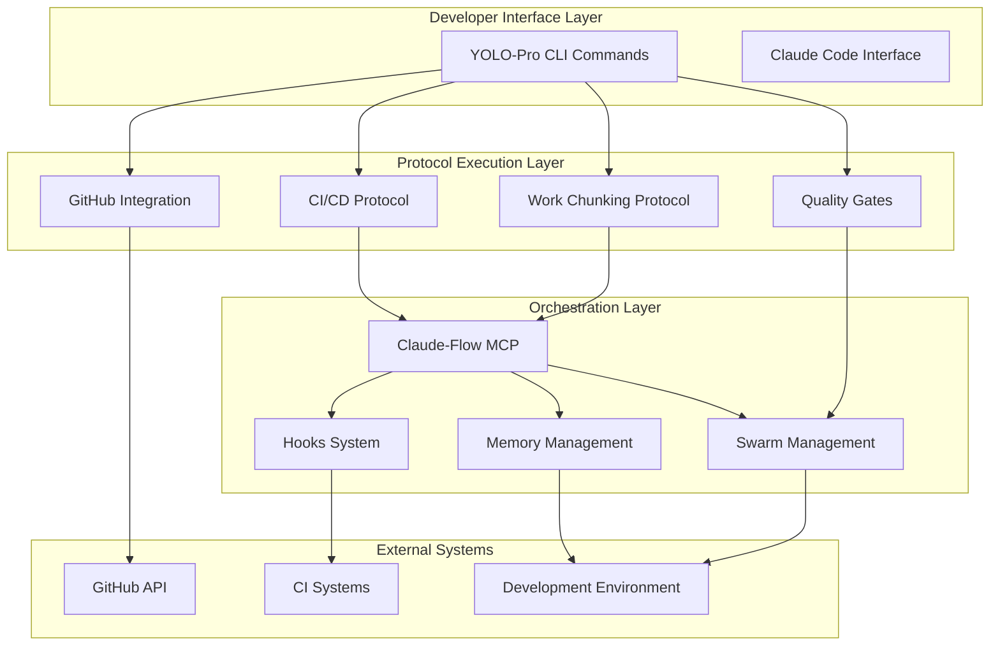
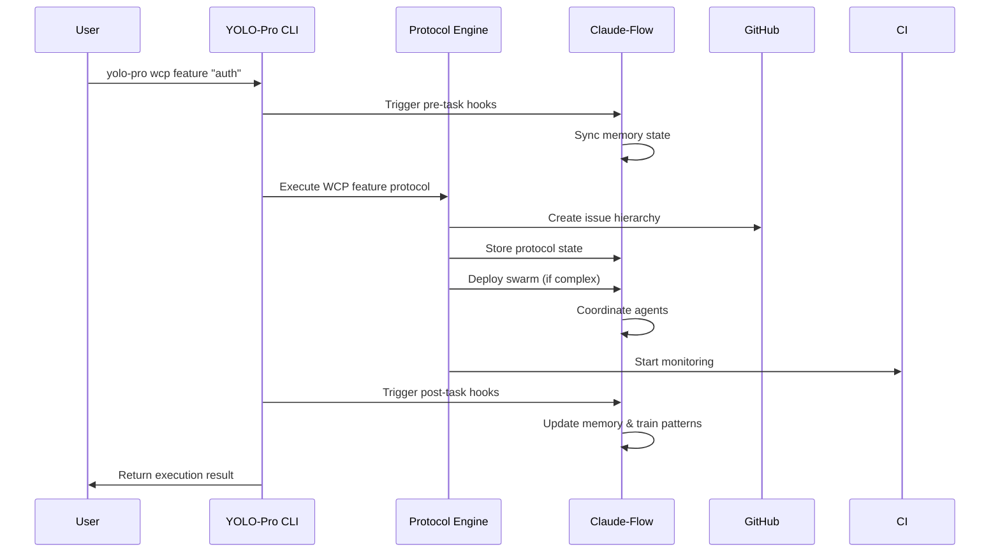

# YOLO-Pro Architecture & Claude-Flow Integration

> **Comprehensive architectural overview of YOLO-Pro CLI and its integration patterns with Claude-Flow orchestration**

## System Architecture Overview

### Core Principle: Separation of Concerns



## Component Architecture

### 1. YOLO-Pro CLI Layer

**Responsibility**: Protocol standardization and automation
**Technology**: Node.js CLI with commander.js
**Interface**: Terminal commands, configuration files

```typescript
// CLI Command Structure
interface YoloProCommand {
  protocol: 'wcp' | 'ci' | 'quality' | 'github';
  action: string;
  options: CommandOptions;
  claudeFlowIntegration: boolean;
}

// Example: WCP Feature Command
class WCPFeatureCommand {
  async execute(featureName: string, options: WCPOptions) {
    // 1. Validate WCP compliance
    await this.validateWCPRules(options);
    
    // 2. Create GitHub structure
    const githubStructure = await this.createGitHubStructure(featureName, options);
    
    // 3. Initialize Claude-Flow coordination
    await this.initializeClaudeFlowCoordination(githubStructure);
    
    // 4. Start protocol execution
    return await this.executeProtocol(featureName, githubStructure, options);
  }
}
```

### 2. Claude-Flow Integration Layer

**Responsibility**: Multi-agent coordination and state management
**Technology**: MCP (Model Context Protocol) server
**Interface**: Memory systems, swarm orchestration, hooks

```typescript
// Integration Interface
interface ClaudeFlowIntegration {
  memory: MemoryNamespace;
  swarm: SwarmOrchestrator;
  hooks: HooksManager;
}

// Memory Integration Pattern
class YoloProMemoryManager {
  constructor(private claudeFlow: ClaudeFlowIntegration) {}
  
  async storeProtocolState(state: ProtocolState): Promise<void> {
    await this.claudeFlow.memory.store('yolo-protocols', {
      currentEpic: state.currentEpic,
      currentFeature: state.currentFeature,
      wcp: state.wcpConfig,
      ciStatus: state.ciStatus
    });
  }
  
  async retrieveProtocolState(): Promise<ProtocolState> {
    return await this.claudeFlow.memory.retrieve('yolo-protocols');
  }
}
```

### 3. Protocol Execution Engine

**Responsibility**: YOLO-Pro protocol implementation
**Technology**: Modular protocol handlers
**Interface**: Standardized protocol execution

```typescript
// Protocol Engine Architecture
class ProtocolEngine {
  private protocols: Map<string, ProtocolHandler> = new Map();
  
  constructor(
    private claudeFlow: ClaudeFlowIntegration,
    private github: GitHubIntegration,
    private ci: CIIntegration
  ) {
    this.registerProtocols();
  }
  
  private registerProtocols() {
    this.protocols.set('wcp', new WorkChunkingProtocol(this.claudeFlow, this.github));
    this.protocols.set('ci', new ContinuousIntegrationProtocol(this.claudeFlow, this.ci));
    this.protocols.set('quality', new QualityGateProtocol(this.claudeFlow));
  }
}

// Work Chunking Protocol Handler
class WorkChunkingProtocol implements ProtocolHandler {
  async executeFeatureCreation(
    featureName: string, 
    options: WCPOptions
  ): Promise<WCPResult> {
    // 1. Validate WCP rules (1-3 issues, max 7 features per EPIC)
    this.validateWCPConstraints(options);
    
    // 2. Create GitHub hierarchy
    const epicIssue = await this.github.createEpicIssue(options.epic);
    const featureIssue = await this.github.createFeatureIssue(featureName, epicIssue);
    const subIssues = await this.github.createSubIssues(featureIssue, options.issues);
    
    // 3. Establish GraphQL relationships
    await this.github.linkIssueHierarchy(epicIssue, featureIssue, subIssues);
    
    // 4. Initialize Claude-Flow coordination
    if (subIssues.length >= 2) {
      await this.claudeFlow.swarm.deploy({
        topology: 'hierarchical',
        agents: ['researcher', 'coder', 'tester'],
        context: { feature: featureName, issues: subIssues }
      });
    }
    
    // 5. Store protocol state
    await this.claudeFlow.memory.store('yolo-protocols', {
      currentFeature: featureIssue,
      wcp: { phase: 'execution', progress: 0 }
    });
    
    return { success: true, feature: featureIssue, issues: subIssues };
  }
}
```

## Integration Patterns

### 1. Memory-Driven Coordination

**Pattern**: Shared state between YOLO-Pro and Claude-Flow
**Implementation**: Bidirectional memory synchronization

```typescript
// Memory Synchronization Pattern
class MemorySynchronizer {
  async syncBidirectional(): Promise<void> {
    // YOLO-Pro → Claude-Flow
    const yoloProState = await this.getYoloProState();
    await this.claudeFlow.memory.store('yolo-protocols', yoloProState);
    
    // Claude-Flow → YOLO-Pro  
    const claudeFlowState = await this.claudeFlow.memory.retrieve('coordination');
    await this.updateYoloProState(claudeFlowState);
  }
}

// Memory Schema
interface ProtocolMemorySchema {
  yolo_protocols: {
    current_epic: EpicDetails;
    current_feature: FeatureDetails;
    wcp_config: WCPConfiguration;
    ci_status: CIStatus;
    swarm_coordination: SwarmState;
  };
  coordination: {
    active_agents: AgentDetails[];
    task_queue: TaskQueue;
    performance_metrics: Metrics;
  };
}
```

### 2. Hooks-Driven Integration

**Pattern**: Automatic coordination via lifecycle hooks
**Implementation**: Pre/post operation hooks

```typescript
// Hooks Integration System
class HooksManager {
  async registerYoloProHooks(): Promise<void> {
    // Pre-command hooks
    await this.claudeFlow.hooks.register('pre-task', async (context) => {
      if (context.source === 'yolo-pro') {
        await this.syncMemoryState();
        await this.prepareSwarmIfNeeded(context);
      }
    });
    
    // Post-command hooks
    await this.claudeFlow.hooks.register('post-task', async (context) => {
      if (context.source === 'yolo-pro') {
        await this.updateProtocolState(context.result);
        await this.trainNeuralPatterns(context);
      }
    });
  }
}

// Hook Execution Flow
class YoloProCommand {
  async execute(): Promise<CommandResult> {
    // 1. Pre-execution hook
    await this.claudeFlow.hooks.trigger('pre-task', {
      source: 'yolo-pro',
      command: this.commandName,
      options: this.options
    });
    
    // 2. Execute command logic
    const result = await this.executeCommandLogic();
    
    // 3. Post-execution hook
    await this.claudeFlow.hooks.trigger('post-task', {
      source: 'yolo-pro',
      result: result,
      performance: this.performanceMetrics
    });
    
    return result;
  }
}
```

### 3. Swarm Coordination Pattern

**Pattern**: Strategic handoff between protocol execution and multi-agent orchestration
**Implementation**: Complexity-based swarm deployment

```typescript
// Swarm Coordination Strategy
class SwarmCoordinator {
  async determineSwarmRequirement(feature: FeatureDetails): Promise<SwarmConfig | null> {
    const complexity = this.calculateComplexity(feature);
    
    if (complexity.score < 2) {
      return null; // No swarm needed
    }
    
    return {
      topology: this.selectTopology(complexity),
      agents: this.selectAgents(complexity),
      maxAgents: Math.min(complexity.score * 2, 8)
    };
  }
  
  private calculateComplexity(feature: FeatureDetails): ComplexityScore {
    return {
      issueCount: feature.subIssues.length,
      technicalComplexity: this.analyzeTechnicalComplexity(feature),
      crossSystemIntegration: this.analyzeIntegrationPoints(feature),
      score: this.computeOverallScore()
    };
  }
  
  private selectTopology(complexity: ComplexityScore): SwarmTopology {
    if (complexity.crossSystemIntegration > 3) return 'mesh';
    if (complexity.issueCount > 3) return 'hierarchical';
    return 'star';
  }
}

// Swarm-Protocol Integration
class SwarmIntegratedProtocol {
  async executeWithSwarmCoordination(
    protocolAction: ProtocolAction
  ): Promise<ProtocolResult> {
    const swarmConfig = await this.swarmCoordinator.determineSwarmRequirement(
      protocolAction.context
    );
    
    if (swarmConfig) {
      // Deploy swarm for complex operations
      const swarm = await this.claudeFlow.swarm.deploy(swarmConfig);
      
      // Execute protocol with swarm coordination
      return await this.executeWithSwarm(protocolAction, swarm);
    } else {
      // Execute protocol directly for simple operations
      return await this.executeDirect(protocolAction);
    }
  }
}
```

## Data Flow Architecture

### 1. Command Execution Flow



### 2. State Management Flow

```typescript
// State Management Architecture
interface SystemState {
  yolo_pro: {
    activeProtocols: ProtocolInstance[];
    configuration: YoloProConfig;
    executionHistory: CommandHistory[];
  };
  claude_flow: {
    activeSwarms: SwarmInstance[];
    memoryState: MemoryNamespaces;
    agentMetrics: AgentPerformance[];
  };
  external_systems: {
    github: GitHubState;
    ci: CISystemState;
    development: DevEnvironmentState;
  };
}

class StateManager {
  async synchronizeState(): Promise<void> {
    const state = await this.getCurrentState();
    
    // Ensure consistency across all system components
    await Promise.all([
      this.syncYoloProState(state.yolo_pro),
      this.syncClaudeFlowState(state.claude_flow),
      this.syncExternalSystemsState(state.external_systems)
    ]);
  }
}
```

## Performance Architecture

### 1. Execution Optimization

**Strategy**: Parallel execution with intelligent batching
**Implementation**: Concurrent protocol operations

```typescript
// Parallel Execution Engine
class ParallelExecutionEngine {
  async executeProtocolBatch(protocols: ProtocolAction[]): Promise<ProtocolResult[]> {
    // Group protocols by dependency chains
    const dependencyGroups = this.groupByDependencies(protocols);
    
    // Execute each group in parallel
    const results: ProtocolResult[] = [];
    for (const group of dependencyGroups) {
      const groupResults = await Promise.all(
        group.map(protocol => this.executeProtocol(protocol))
      );
      results.push(...groupResults);
    }
    
    return results;
  }
  
  private async executeProtocol(protocol: ProtocolAction): Promise<ProtocolResult> {
    // Use worker threads for CPU-intensive operations
    if (protocol.isCPUIntensive) {
      return await this.executeInWorker(protocol);
    }
    
    // Use async execution for I/O operations
    return await this.executeAsync(protocol);
  }
}
```

### 2. Memory Optimization

**Strategy**: Efficient memory management with TTL and compression
**Implementation**: Smart caching and cleanup

```typescript
// Memory Management Strategy
class MemoryManager {
  private cache = new Map<string, CacheEntry>();
  
  async storeWithTTL(
    namespace: string, 
    data: any, 
    ttl: number = 3600
  ): Promise<void> {
    const compressed = await this.compress(data);
    const entry: CacheEntry = {
      data: compressed,
      timestamp: Date.now(),
      ttl: ttl * 1000,
      size: this.calculateSize(compressed)
    };
    
    this.cache.set(namespace, entry);
    
    // Schedule cleanup
    setTimeout(() => this.cleanup(namespace), ttl * 1000);
  }
  
  async retrieve(namespace: string): Promise<any> {
    const entry = this.cache.get(namespace);
    if (!entry || this.isExpired(entry)) {
      return null;
    }
    
    return await this.decompress(entry.data);
  }
  
  private async cleanup(namespace: string): Promise<void> {
    const entry = this.cache.get(namespace);
    if (entry && this.isExpired(entry)) {
      this.cache.delete(namespace);
    }
  }
}
```

## Security Architecture

### 1. Authentication & Authorization

**Strategy**: Secure credential management and API access
**Implementation**: Token-based authentication with rotation

```typescript
// Security Manager
class SecurityManager {
  private credentials: CredentialStore;
  
  async authenticateGitHub(): Promise<GitHubAuth> {
    const token = await this.credentials.getSecure('github_token');
    if (this.isTokenExpired(token)) {
      return await this.refreshGitHubToken();
    }
    return { token, expires: token.expires };
  }
  
  async validateCommandPermissions(
    command: YoloProCommand, 
    context: ExecutionContext
  ): Promise<boolean> {
    // Validate user has permission for this operation
    const permissions = await this.getUserPermissions(context.user);
    return this.commandAllowed(command, permissions);
  }
}
```

### 2. Data Privacy

**Strategy**: Sensitive data encryption and minimal exposure
**Implementation**: Field-level encryption

```typescript
// Data Privacy Manager
class PrivacyManager {
  async sanitizeForLogging(data: any): Promise<any> {
    const sanitized = { ...data };
    
    // Remove sensitive fields
    delete sanitized.github_token;
    delete sanitized.user_credentials;
    
    // Hash PII data
    if (sanitized.user_email) {
      sanitized.user_email = this.hashPII(sanitized.user_email);
    }
    
    return sanitized;
  }
  
  async encryptSensitiveData(data: any): Promise<EncryptedData> {
    const sensitiveFields = this.identifySensitiveFields(data);
    const encrypted = { ...data };
    
    for (const field of sensitiveFields) {
      encrypted[field] = await this.encrypt(data[field]);
    }
    
    return encrypted;
  }
}
```

## Deployment Architecture

### 1. Distribution Strategy

**Strategy**: NPM package distribution with auto-updates
**Implementation**: Semantic versioning with migration support

```typescript
// Update Manager
class UpdateManager {
  async checkForUpdates(): Promise<UpdateInfo | null> {
    const currentVersion = this.getCurrentVersion();
    const latestVersion = await this.getLatestVersion();
    
    if (this.isUpdateRequired(currentVersion, latestVersion)) {
      return {
        currentVersion,
        latestVersion,
        migrationRequired: this.isMigrationRequired(currentVersion, latestVersion),
        changelog: await this.getChangelog(currentVersion, latestVersion)
      };
    }
    
    return null;
  }
  
  async performUpdate(updateInfo: UpdateInfo): Promise<void> {
    // Backup current configuration
    await this.backupConfiguration();
    
    // Update CLI package
    await this.updatePackage(updateInfo.latestVersion);
    
    // Run migration if needed
    if (updateInfo.migrationRequired) {
      await this.runMigration(updateInfo);
    }
    
    // Verify update success
    await this.verifyUpdate();
  }
}
```

### 2. Configuration Management

**Strategy**: Layered configuration with environment-specific overrides
**Implementation**: Hierarchical config resolution

```typescript
// Configuration Manager
class ConfigurationManager {
  private configLayers: ConfigLayer[] = [];
  
  constructor() {
    // Configuration precedence (highest to lowest)
    this.configLayers = [
      new CommandLineConfigLayer(),     // --config flags
      new EnvironmentConfigLayer(),     // Environment variables
      new ProjectConfigLayer(),         // .yolo-pro.config.json
      new UserConfigLayer(),           // ~/.yolo-pro/config.json
      new TeamConfigLayer(),           // Team shared configuration
      new DefaultConfigLayer()         // Built-in defaults
    ];
  }
  
  async resolveConfiguration(): Promise<YoloProConfig> {
    const config = new YoloProConfig();
    
    // Merge configurations from lowest to highest precedence
    for (const layer of this.configLayers.reverse()) {
      const layerConfig = await layer.load();
      config.merge(layerConfig);
    }
    
    return config.validate();
  }
}
```

## Monitoring & Observability

### 1. Performance Monitoring

```typescript
// Performance Monitor
class PerformanceMonitor {
  async trackCommandExecution(command: YoloProCommand): Promise<void> {
    const startTime = Date.now();
    const memoryUsage = process.memoryUsage();
    
    try {
      await command.execute();
    } finally {
      const endTime = Date.now();
      const finalMemory = process.memoryUsage();
      
      await this.recordMetrics({
        command: command.name,
        duration: endTime - startTime,
        memoryDelta: finalMemory.heapUsed - memoryUsage.heapUsed,
        success: true
      });
    }
  }
}
```

### 2. Error Tracking

```typescript
// Error Tracking System
class ErrorTracker {
  async captureError(error: Error, context: ExecutionContext): Promise<void> {
    const errorReport = {
      message: error.message,
      stack: error.stack,
      context: await this.sanitizeContext(context),
      timestamp: new Date().toISOString(),
      version: this.getVersion()
    };
    
    // Store locally for diagnostics
    await this.storeErrorReport(errorReport);
    
    // Send to error tracking service (if configured)
    if (this.isErrorReportingEnabled()) {
      await this.sendErrorReport(errorReport);
    }
  }
}
```

---

This architectural overview demonstrates how YOLO-Pro CLI integrates seamlessly with Claude-Flow while maintaining clear separation of concerns. The modular design ensures scalability, maintainability, and extensibility while delivering the high-velocity development experience that teams expect.